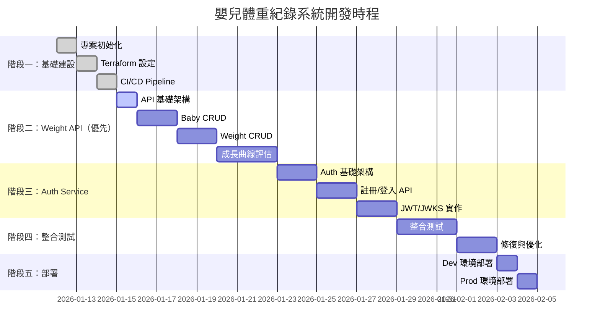

# 嬰兒體重紀錄系統 - 開發時程與進度

> 專案開發追蹤文件

---

## 專案資訊

- **專案名稱**：Baby Weight Recorder
- **開始日期**：2026-01-12
- **目標上線日期**：_待定_
- **技術規格書**：[baby_weight_recorder-spec.md](./baby_weight_recorder-spec.md)

---

## 開發階段總覽

---

## 階段一：基礎建設

### 1.1 專案初始化

| 任務 | 狀態 | 預計時間 | 說明 |
|------|------|----------|------|
| 建立專案結構 | ✅ 完成 | 0.5 天 | api/, auth/, tests/, terraform/ |
| 設定 uv + pyproject.toml | ✅ 完成 | 0.5 天 | 依賴管理、開發工具設定 |
| 設定 Ruff + MyPy | ✅ 完成 | 0.5 天 | Linter、Type Checker |
| 建立 Dockerfile | ✅ 完成 | 0.5 天 | api/Dockerfile, auth/Dockerfile |

### 1.2 Terraform 基礎建設

| 任務 | 狀態 | 預計時間 | 說明 |
|------|------|----------|------|
| GCP Project 設定 | ✅ 完成 | 0.5 天 | 啟用必要 API |
| Artifact Registry | ✅ 完成 | 0.5 天 | Container Registry |
| Firestore 設定 | ✅ 完成 | 0.5 天 | Database + Index |
| Secret Manager | ✅ 完成 | 0.5 天 | JWT Key 等機敏資料 |
| Cloud Run (Dev) | ✅ 完成 | 1 天 | Dev 環境（placeholder image） |
| API Gateway | ⬜ 待開始 | 1 天 | OpenAPI Spec + Gateway（GCP 部署需 10-20 分鐘，暫時跳過） |
| Workload Identity | ✅ 完成 | 0.5 天 | GitHub Actions 認證 |

> **TODO**: API Gateway 模組已準備好，但 GCP 部署時間過長（10-20 分鐘），建議待應用程式開發完成後再啟用。目前可直接使用 Cloud Run URLs 進行開發測試。

### 1.3 CI/CD Pipeline

| 任務 | 狀態 | 預計時間 | 說明 |
|------|------|----------|------|
| ci.yml | ✅ 完成 | 0.5 天 | Test + Lint + Docker Build |
| terraform-plan.yml | ✅ 完成 | 0.5 天 | PR 時執行 plan（含 PR comment） |
| deploy-dev.yml | ✅ 完成 | 1 天 | 自動部署 Dev + Smoke Test |
| deploy-prod.yml | ✅ 完成 | 0.5 天 | 手動部署 Prod（需確認） |

---

## 階段二：Weight API Service（優先開發）

> 📌 **優先開發 Weight API**，先讓核心功能在本地跑起來，Auth 整合稍後處理。

### 2.1 API 基礎架構

| 任務 | 狀態 | 預計時間 | 說明 |
|------|------|----------|------|
| FastAPI 應用程式架構 | ✅ 完成 | 0.5 天 | main.py, routers/, models/ |
| InMemory Repository | ✅ 完成 | 0.5 天 | 開發/測試用，重啟資料消失 |
| Firestore Repository | ✅ 完成 | 0.5 天 | 生產環境用，支援 Emulator |
| 本地開發環境 | ✅ 完成 | 0.5 天 | uvicorn 啟動、熱重載、dev token |

### 2.2 Baby CRUD

| 任務 | 狀態 | 預計時間 | 說明 |
|------|------|----------|------|
| POST /v1/babies | ✅ 完成 | 0.5 天 | 建立嬰兒 |
| GET /v1/babies | ✅ 完成 | 0.5 天 | 列出嬰兒 |
| GET /v1/babies/{id} | ✅ 完成 | 0.5 天 | 取得單一嬰兒 |
| PUT /v1/babies/{id} | ✅ 完成 | 0.5 天 | 更新嬰兒 |
| DELETE /v1/babies/{id} | ✅ 完成 | 0.5 天 | 刪除嬰兒 |
| Membership 權限檢查 | ✅ 完成 | 0.5 天 | owner/editor/viewer（dev token） |
| 單元測試 | ✅ 完成 | 1 天 | pytest（13 tests） |

### 2.3 Weight CRUD

| 任務 | 狀態 | 預計時間 | 說明 |
|------|------|----------|------|
| POST /v1/babies/{id}/weights | ✅ 完成 | 0.5 天 | 新增體重 |
| GET /v1/babies/{id}/weights | ✅ 完成 | 0.5 天 | 查詢體重（含時間範圍篩選） |
| GET /v1/babies/{id}/weights/{wid} | ✅ 完成 | 0.5 天 | 取得單一體重 |
| PUT /v1/babies/{id}/weights/{wid} | ✅ 完成 | 0.5 天 | 修改體重 |
| DELETE /v1/babies/{id}/weights/{wid} | ✅ 完成 | 0.5 天 | 刪除體重 |
| 單元測試 | ✅ 完成 | 1 天 | pytest（14 tests） |

### 2.4 成長曲線評估

| 任務 | 狀態 | 預計時間 | 說明 |
|------|------|----------|------|
| WHO 成長數據整合 | ✅ 完成 | 1 天 | 男/女嬰 0-24 月 LMS 參數 |
| 百分位計算邏輯 | ✅ 完成 | 1 天 | Z-Score、Percentile |
| GET .../weights/{wid}/assessment | ✅ 完成 | 0.5 天 | 完整評估 API |
| includeAssessment 參數 | ✅ 完成 | 0.5 天 | 列表批次評估 |
| 單元測試 | ✅ 完成 | 1 天 | 8 tests passed |

---

## 階段三：Auth Service

### 3.1 Auth 基礎架構

| 任務 | 狀態 | 預計時間 | 說明 |
|------|------|----------|------|
| FastAPI 應用程式架構 | ⬜ 待開始 | 0.5 天 | main.py, routers/ |
| Firestore Repository | ⬜ 待開始 | 1 天 | User 資料存取 |
| 密碼雜湊（bcrypt） | ⬜ 待開始 | 0.5 天 | passlib 整合 |

### 3.2 註冊/登入 API

| 任務 | 狀態 | 預計時間 | 說明 |
|------|------|----------|------|
| POST /auth/register | ⬜ 待開始 | 1 天 | 含邀請碼驗證 |
| POST /auth/token | ⬜ 待開始 | 1 天 | 登入取得 JWT |
| 單元測試 | ⬜ 待開始 | 1 天 | pytest |

### 3.3 JWT/JWKS 實作

| 任務 | 狀態 | 預計時間 | 說明 |
|------|------|----------|------|
| RSA Key 管理 | ⬜ 待開始 | 0.5 天 | 產生/讀取金鑰 |
| JWT 簽發 | ⬜ 待開始 | 0.5 天 | python-jose |
| GET /.well-known/jwks.json | ⬜ 待開始 | 0.5 天 | 公鑰 Endpoint |
| 單元測試 | ⬜ 待開始 | 0.5 天 | JWT 驗證測試 |

### 3.4 Weight API 整合

| 任務 | 狀態 | 預計時間 | 說明 |
|------|------|----------|------|
| JWT 驗證 Middleware | ⬜ 待開始 | 0.5 天 | JWKS 驗證 |
| Identity Link 解析 | ⬜ 待開始 | 0.5 天 | iss+sub → internalUserId |
| 移除 Mock User | ⬜ 待開始 | 0.5 天 | 改用真實認證 |

---

## 階段四：整合測試

| 任務 | 狀態 | 預計時間 | 說明 |
|------|------|----------|------|
| 本地 E2E 測試 | ⬜ 待開始 | 1 天 | Firestore Emulator |
| Auth → API 整合測試 | ⬜ 待開始 | 1 天 | 完整認證流程 |
| API Gateway 測試 | ⬜ 待開始 | 1 天 | Dev 環境 |
| 效能測試（基本） | ⬜ 待開始 | 0.5 天 | 基本負載測試 |
| Bug 修復 | ⬜ 待開始 | 2 天 | 預留時間 |

---

## 階段五：部署

| 任務 | 狀態 | 預計時間 | 說明 |
|------|------|----------|------|
| Dev 環境部署 | ⬜ 待開始 | 0.5 天 | terraform apply |
| Dev 環境驗證 | ⬜ 待開始 | 0.5 天 | Smoke Test |
| Prod 環境部署 | ⬜ 待開始 | 0.5 天 | terraform apply |
| Prod 環境驗證 | ⬜ 待開始 | 0.5 天 | Smoke Test |
| 文件更新 | ⬜ 待開始 | 0.5 天 | README、部署文件 |

---

## 進度追蹤

### 統計

| 階段 | 總任務 | 完成 | 進行中 | 待開始 |
|------|--------|------|--------|--------|
| 階段一：基礎建設 | 15 | 14 | 0 | 1 |
| 階段二：Weight API | 21 | 21 | 0 | 0 |
| 階段三：Auth Service | 13 | 0 | 0 | 13 |
| 階段四：整合測試 | 5 | 0 | 0 | 5 |
| 階段五：部署 | 5 | 0 | 0 | 5 |
| **總計** | **59** | **35** | **0** | **24** |

### 預估工時

| 階段 | 預估天數 |
|------|----------|
| 階段一：基礎建設 | 5 天 |
| 階段二：Weight API | 8 天 |
| 階段三：Auth Service | 8 天 |
| 階段四：整合測試 | 5 天 |
| 階段五：部署 | 2 天 |
| **總計** | **28 天** |

---

## 風險與注意事項

| 風險 | 影響 | 緩解措施 |
|------|------|----------|
| WHO 成長數據格式複雜 | 中 | 預留額外時間研究資料格式 |
| API Gateway 部署時間過長 | 中 | 實測需 10-20 分鐘，建議開發完成後再部署，先用 Cloud Run URL |
| Workload Identity 設定 | 低 | 已有經驗，風險較低 |
| 第一次使用 uv | 低 | 工具成熟度高 |

---

## 更新紀錄

| 日期 | 更新內容 |
|------|----------|
| 2026-01-12 | 初版建立 |
| 2026-01-12 | 完成 1.1 專案初始化（專案結構、pyproject.toml、Ruff/MyPy、Dockerfile） |
| 2026-01-12 | 完成 1.2 Terraform 基礎建設（6/7 模組），API Gateway 暫緩（GCP 部署時間過長） |
| 2026-01-12 | 完成 1.3 CI/CD Pipeline（ci.yml、terraform-plan.yml、deploy-dev.yml、deploy-prod.yml） |
| 2026-01-12 | 調整開發順序：階段二改為 Weight API（優先本地開發），階段三改為 Auth Service |
| 2026-01-12 | 完成 2.1 API 基礎架構、2.2 Baby CRUD、2.3 Weight CRUD（本地 In-Memory 模式） |
| 2026-01-12 | 完成 Firestore Repository 實作，支援 Emulator 和真實 GCP Firestore |
| 2026-01-12 | 完成 Baby/Weight CRUD 單元測試（27 tests passed） |
| 2026-01-13 | 完成成長曲線評估功能（WHO 數據、AssessmentService、API、8 tests） |

## 當前環境資訊

### Cloud Run URLs（Dev 環境）

| 服務 | URL | 存取權限 |
|------|-----|----------|
| Auth Service | https://auth-service-dev-ggofz32qfa-de.a.run.app | 公開 |
| Weight API | https://weight-api-dev-ggofz32qfa-de.a.run.app | 需認證 |

### 其他資源

- **Artifact Registry**: `asia-east1-docker.pkg.dev/babyweightrecorder/baby-weight-dev`
- **Firestore Database**: `baby-weight-dev`
- **Workload Identity Provider**: `projects/750410344862/locations/global/workloadIdentityPools/github-pool-dev/providers/github-provider`
- **GitHub Actions SA**: `github-actions-dev@babyweightrecorder.iam.gserviceaccount.com`

---

**備註**：
- 狀態圖示：⬜ 待開始 | 🔄 進行中 | ✅ 完成 | ❌ 取消
- 預估時間以 1 人全職開發計算
- 實際進度可能因需求變更而調整
