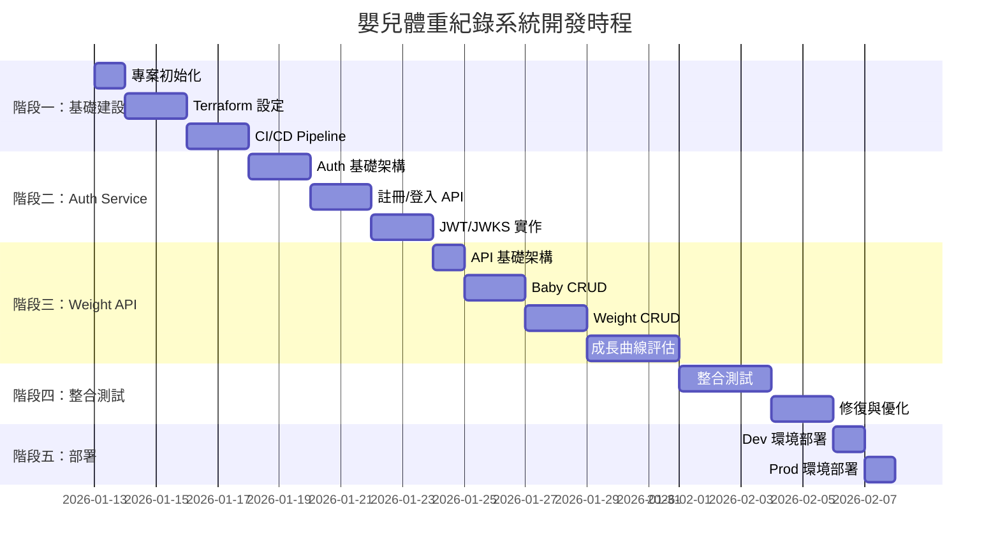

# 嬰兒體重紀錄系統 - 開發時程與進度

> 專案開發追蹤文件

---

## 專案資訊

- **專案名稱**：Baby Weight Recorder
- **開始日期**：2026-01-12
- **目標上線日期**：_待定_
- **技術規格書**：[baby_weight_recorder-spec.md](./baby_weight_recorder-spec.md)

---

## 開發階段總覽

---

## 階段一：基礎建設

### 1.1 專案初始化

| 任務 | 狀態 | 預計時間 | 說明 |
|------|------|----------|------|
| 建立專案結構 | ✅ 完成 | 0.5 天 | api/, auth/, tests/, terraform/ |
| 設定 uv + pyproject.toml | ✅ 完成 | 0.5 天 | 依賴管理、開發工具設定 |
| 設定 Ruff + MyPy | ✅ 完成 | 0.5 天 | Linter、Type Checker |
| 建立 Dockerfile | ✅ 完成 | 0.5 天 | api/Dockerfile, auth/Dockerfile |

### 1.2 Terraform 基礎建設

| 任務 | 狀態 | 預計時間 | 說明 |
|------|------|----------|------|
| GCP Project 設定 | ✅ 完成 | 0.5 天 | 啟用必要 API |
| Artifact Registry | ✅ 完成 | 0.5 天 | Container Registry |
| Firestore 設定 | ✅ 完成 | 0.5 天 | Database + Index |
| Secret Manager | ✅ 完成 | 0.5 天 | JWT Key 等機敏資料 |
| Cloud Run (Dev) | ✅ 完成 | 1 天 | Dev 環境 |
| API Gateway | ✅ 完成 | 1 天 | OpenAPI Spec + Gateway |
| Workload Identity | ✅ 完成 | 0.5 天 | GitHub Actions 認證 |

### 1.3 CI/CD Pipeline

| 任務 | 狀態 | 預計時間 | 說明 |
|------|------|----------|------|
| ci.yml | ⬜ 待開始 | 0.5 天 | Test + Lint |
| terraform-plan.yml | ⬜ 待開始 | 0.5 天 | PR 時執行 plan |
| deploy-dev.yml | ⬜ 待開始 | 1 天 | 自動部署 Dev |
| deploy-prod.yml | ⬜ 待開始 | 0.5 天 | 手動部署 Prod |

---

## 階段二：Auth Service

### 2.1 Auth 基礎架構

| 任務 | 狀態 | 預計時間 | 說明 |
|------|------|----------|------|
| FastAPI 應用程式架構 | ⬜ 待開始 | 0.5 天 | main.py, routers/ |
| Firestore Repository | ⬜ 待開始 | 1 天 | User 資料存取 |
| 密碼雜湊（bcrypt） | ⬜ 待開始 | 0.5 天 | passlib 整合 |

### 2.2 註冊/登入 API

| 任務 | 狀態 | 預計時間 | 說明 |
|------|------|----------|------|
| POST /auth/register | ⬜ 待開始 | 1 天 | 含邀請碼驗證 |
| POST /auth/token | ⬜ 待開始 | 1 天 | 登入取得 JWT |
| 單元測試 | ⬜ 待開始 | 1 天 | pytest |

### 2.3 JWT/JWKS 實作

| 任務 | 狀態 | 預計時間 | 說明 |
|------|------|----------|------|
| RSA Key 管理 | ⬜ 待開始 | 0.5 天 | 產生/讀取金鑰 |
| JWT 簽發 | ⬜ 待開始 | 0.5 天 | python-jose |
| GET /.well-known/jwks.json | ⬜ 待開始 | 0.5 天 | 公鑰 Endpoint |
| 單元測試 | ⬜ 待開始 | 0.5 天 | JWT 驗證測試 |

---

## 階段三：Weight API Service

### 3.1 API 基礎架構

| 任務 | 狀態 | 預計時間 | 說明 |
|------|------|----------|------|
| FastAPI 應用程式架構 | ⬜ 待開始 | 0.5 天 | main.py, routers/ |
| JWT 驗證 Middleware | ⬜ 待開始 | 0.5 天 | JWKS 驗證 |
| Identity Link 解析 | ⬜ 待開始 | 0.5 天 | iss+sub → internalUserId |

### 3.2 Baby CRUD

| 任務 | 狀態 | 預計時間 | 說明 |
|------|------|----------|------|
| POST /v1/babies | ⬜ 待開始 | 0.5 天 | 建立嬰兒 |
| GET /v1/babies | ⬜ 待開始 | 0.5 天 | 列出嬰兒 |
| GET /v1/babies/{id} | ⬜ 待開始 | 0.5 天 | 取得單一嬰兒 |
| Membership 權限檢查 | ⬜ 待開始 | 0.5 天 | owner/editor/viewer |
| 單元測試 | ⬜ 待開始 | 1 天 | pytest |

### 3.3 Weight CRUD

| 任務 | 狀態 | 預計時間 | 說明 |
|------|------|----------|------|
| POST /v1/babies/{id}/weights | ⬜ 待開始 | 0.5 天 | 新增體重 |
| GET /v1/babies/{id}/weights | ⬜ 待開始 | 0.5 天 | 查詢體重 |
| PUT /v1/babies/{id}/weights/{wid} | ⬜ 待開始 | 0.5 天 | 修改體重 |
| DELETE /v1/babies/{id}/weights/{wid} | ⬜ 待開始 | 0.5 天 | 刪除體重 |
| 單元測試 | ⬜ 待開始 | 1 天 | pytest |

### 3.4 成長曲線評估

| 任務 | 狀態 | 預計時間 | 說明 |
|------|------|----------|------|
| WHO 成長數據整合 | ⬜ 待開始 | 1 天 | 男/女嬰百分位表 |
| 百分位計算邏輯 | ⬜ 待開始 | 1 天 | Z-Score、Percentile |
| GET .../weights/{wid}/assessment | ⬜ 待開始 | 0.5 天 | 評估 API |
| includeAssessment 參數 | ⬜ 待開始 | 0.5 天 | 批次評估 |
| 單元測試 | ⬜ 待開始 | 1 天 | 各種邊界案例 |

---

## 階段四：整合測試

| 任務 | 狀態 | 預計時間 | 說明 |
|------|------|----------|------|
| 本地 E2E 測試 | ⬜ 待開始 | 1 天 | Firestore Emulator |
| Auth → API 整合測試 | ⬜ 待開始 | 1 天 | 完整認證流程 |
| API Gateway 測試 | ⬜ 待開始 | 1 天 | Dev 環境 |
| 效能測試（基本） | ⬜ 待開始 | 0.5 天 | 基本負載測試 |
| Bug 修復 | ⬜ 待開始 | 2 天 | 預留時間 |

---

## 階段五：部署

| 任務 | 狀態 | 預計時間 | 說明 |
|------|------|----------|------|
| Dev 環境部署 | ⬜ 待開始 | 0.5 天 | terraform apply |
| Dev 環境驗證 | ⬜ 待開始 | 0.5 天 | Smoke Test |
| Prod 環境部署 | ⬜ 待開始 | 0.5 天 | terraform apply |
| Prod 環境驗證 | ⬜ 待開始 | 0.5 天 | Smoke Test |
| 文件更新 | ⬜ 待開始 | 0.5 天 | README、部署文件 |

---

## 進度追蹤

### 統計

| 階段 | 總任務 | 完成 | 進行中 | 待開始 |
|------|--------|------|--------|--------|
| 階段一：基礎建設 | 15 | 11 | 0 | 4 |
| 階段二：Auth Service | 10 | 0 | 0 | 10 |
| 階段三：Weight API | 17 | 0 | 0 | 17 |
| 階段四：整合測試 | 5 | 0 | 0 | 5 |
| 階段五：部署 | 5 | 0 | 0 | 5 |
| **總計** | **52** | **11** | **0** | **41** |

### 預估工時

| 階段 | 預估天數 |
|------|----------|
| 階段一：基礎建設 | 5 天 |
| 階段二：Auth Service | 6 天 |
| 階段三：Weight API | 8 天 |
| 階段四：整合測試 | 5 天 |
| 階段五：部署 | 2 天 |
| **總計** | **26 天** |

---

## 風險與注意事項

| 風險 | 影響 | 緩解措施 |
|------|------|----------|
| WHO 成長數據格式複雜 | 中 | 預留額外時間研究資料格式 |
| API Gateway 設定繁瑣 | 中 | 參考官方文件、預留 buffer |
| Workload Identity 設定 | 低 | 已有經驗，風險較低 |
| 第一次使用 uv | 低 | 工具成熟度高 |

---

## 更新紀錄

| 日期 | 更新內容 |
|------|----------|
| 2026-01-12 | 初版建立 |
| 2026-01-12 | 完成 1.1 專案初始化（專案結構、pyproject.toml、Ruff/MyPy、Dockerfile） |
| 2026-01-12 | 完成 1.2 Terraform 基礎建設（全部 7 個模組） |

---

**備註**：
- 狀態圖示：⬜ 待開始 | 🔄 進行中 | ✅ 完成 | ❌ 取消
- 預估時間以 1 人全職開發計算
- 實際進度可能因需求變更而調整
