# 嬰兒體重紀錄系統

> 技術規格書（GCP / Cloud Run / Kong Gateway / Firestore）

---

## 目錄

- [嬰兒體重紀錄系統](#嬰兒體重紀錄系統)
  - [目錄](#目錄)
  - [1. 文件資訊](#1-文件資訊)
  - [2. 系統目標與需求](#2-系統目標與需求)
    - [2.1 系統目標](#21-系統目標)
    - [2.2 功能性需求](#22-功能性需求)
    - [2.3 非功能性需求](#23-非功能性需求)
  - [3. 整體系統架構](#3-整體系統架構)
    - [3.1 架構概覽](#31-架構概覽)
    - [3.2 設計原則](#32-設計原則)
  - [4. GCP 元件說明](#4-gcp-元件說明)
    - [4.1 Auth Service（自建最小 OIDC Provider）](#41-auth-service自建最小-oidc-provider)
      - [4.1.1 Auth Service 職責](#411-auth-service-職責)
      - [4.1.2 Auth Service Endpoints](#412-auth-service-endpoints)
      - [4.1.3 JWT Token 規格](#413-jwt-token-規格)
      - [4.1.4 JWKS 規格](#414-jwks-規格)
      - [4.1.5 登入方式](#415-登入方式)
    - [4.2 Kong Gateway（on Cloud Run）](#42-kong-gatewayon-cloud-run)
      - [4.2.1 為什麼選擇 Kong 而非 GCP API Gateway？](#421-為什麼選擇-kong-而非-gcp-api-gateway)
      - [4.2.2 Kong 部署架構](#422-kong-部署架構)
      - [4.2.3 Kong 設定（DB-less Mode）](#423-kong-設定db-less-mode)
      - [4.2.4 Kong Cloud Run 設定](#424-kong-cloud-run-設定)
      - [4.2.5 Kong 負責事項](#425-kong-負責事項)
    - [4.3 Cloud Run – Weight API Service](#43-cloud-run--weight-api-service)
    - [4.4 Firestore（Native Mode）](#44-firestorenative-mode)
  - [5. 認證與授權設計](#5-認證與授權設計)
    - [5.1 認證流程（AuthN）](#51-認證流程authn)
    - [5.2 授權流程（AuthZ）](#52-授權流程authz)
  - [6. Firestore 資料模型設計](#6-firestore-資料模型設計)
    - [6.1 內部使用者 ID 格式](#61-內部使用者-id-格式)
    - [6.2 Collections 結構](#62-collections-結構)
    - [6.3 identity\_links 查詢索引](#63-identity_links-查詢索引)
    - [6.4 身份解析流程](#64-身份解析流程)
    - [6.5 權限邏輯](#65-權限邏輯)
  - [7. API 規格（v1）](#7-api-規格v1)
    - [7.1 建立嬰兒](#71-建立嬰兒)
    - [7.2 新增體重紀錄](#72-新增體重紀錄)
    - [7.3 查詢體重紀錄](#73-查詢體重紀錄)
    - [7.4 修改體重紀錄](#74-修改體重紀錄)
    - [7.5 刪除體重紀錄](#75-刪除體重紀錄)
    - [7.6 成長曲線評估](#76-成長曲線評估)
    - [7.7 批次成長曲線評估（查詢時附帶）](#77-批次成長曲線評估查詢時附帶)
  - [8. 錯誤處理](#8-錯誤處理)
  - [9. 部署與維運建議](#9-部署與維運建議)
    - [9.1 基礎設施即程式碼（IaC）](#91-基礎設施即程式碼iac)
      - [9.1.1 Terraform 管理的 GCP 資源](#911-terraform-管理的-gcp-資源)
      - [9.1.2 Terraform 專案結構](#912-terraform-專案結構)
      - [9.1.3 環境分離策略](#913-環境分離策略)
      - [9.1.4 Terraform State 管理](#914-terraform-state-管理)
      - [9.1.5 機敏資料處理](#915-機敏資料處理)
      - [9.1.6 部署流程](#916-部署流程)
      - [9.1.7 關鍵 Terraform 設定範例](#917-關鍵-terraform-設定範例)
    - [9.2 Cloud Run 設定](#92-cloud-run-設定)
    - [9.3 Firestore 設定](#93-firestore-設定)
    - [9.4 Logging 設定](#94-logging-設定)
    - [9.5 Secrets 管理](#95-secrets-管理)
    - [9.6 GitHub Actions CI/CD](#96-github-actions-cicd)
      - [9.6.1 Workflow 總覽](#961-workflow-總覽)
      - [9.6.2 GitHub Actions 檔案結構](#962-github-actions-檔案結構)
      - [9.6.3 GCP 認證設定（Workload Identity Federation）](#963-gcp-認證設定workload-identity-federation)
      - [9.6.4 CI Workflow（ci.yml）](#964-ci-workflowciyml)
      - [9.6.5 Deploy Dev Workflow（deploy-dev.yml）](#965-deploy-dev-workflowdeploy-devyml)
      - [9.6.6 Deploy Prod Workflow（deploy-prod.yml）](#966-deploy-prod-workflowdeploy-prodyml)
      - [9.6.7 Terraform Plan for PR（terraform-plan.yml）](#967-terraform-plan-for-prterraform-planyml)
      - [9.6.8 部署環境保護](#968-部署環境保護)
      - [9.6.9 完整部署流程](#969-完整部署流程)
  - [10. 本地開發與測試策略](#10-本地開發與測試策略)
    - [10.1 本地開發目標](#101-本地開發目標)
    - [10.2 Firestore Emulator 開發模式（主要推薦）](#102-firestore-emulator-開發模式主要推薦)
      - [10.2.1 工具需求](#1021-工具需求)
      - [10.2.2 啟動 Emulator](#1022-啟動-emulator)
      - [10.2.3 API 服務連線 Emulator](#1023-api-服務連線-emulator)
    - [10.3 In-Memory Repository 模式（測試用）](#103-in-memory-repository-模式測試用)
    - [10.4 本地認證（Auth）策略](#104-本地認證auth策略)
      - [10.4.1 Dev Auth 模式（預設）](#1041-dev-auth-模式預設)
      - [10.4.2 本地 Auth Service（進階）](#1042-本地-auth-service進階)
    - [10.5 Auth 模式切換設計](#105-auth-模式切換設計)
    - [10.6 本地環境變數](#106-本地環境變數)
      - [API Service 環境變數](#api-service-環境變數)
      - [Auth Service 環境變數](#auth-service-環境變數)
    - [10.7 本地資料初始化建議](#107-本地資料初始化建議)
    - [10.8 本地測試流程（範例）](#108-本地測試流程範例)
    - [10.9 測試策略總覽](#109-測試策略總覽)
      - [10.9.1 測試層次與 Auth/Gateway 配置](#1091-測試層次與-authgateway-配置)
      - [10.9.2 繞過 Auth 的快速測試](#1092-繞過-auth-的快速測試)
      - [10.9.3 不繞過 Auth 的整合測試](#1093-不繞過-auth-的整合測試)
      - [10.9.4 Kong Gateway 測試策略](#1094-kong-gateway-測試策略)
      - [10.9.5 本地 Kong 整合測試（推薦）](#1095-本地-kong-整合測試推薦)
  - [11. IdP 可替換設計](#11-idp-可替換設計)
    - [11.1 核心相容性設計](#111-核心相容性設計)
    - [11.2 升級路線 1：自建 Auth → Keycloak](#112-升級路線-1自建-auth--keycloak)
    - [11.3 升級路線 2：自建 Auth → Firebase Auth](#113-升級路線-2自建-auth--firebase-auth)
    - [11.4 身份綁定策略（多 IdP 共存）](#114-身份綁定策略多-idp-共存)
    - [11.5 升級時的元件影響](#115-升級時的元件影響)
  - [12. 開發指引](#12-開發指引)
    - [12.1 Python 開發規範](#121-python-開發規範)
      - [12.1.1 Type Hints（必要）](#1211-type-hints必要)
      - [12.1.2 Pydantic Models](#1212-pydantic-models)
      - [12.1.3 MyPy 設定](#1213-mypy-設定)
    - [12.2 套件管理（uv）](#122-套件管理uv)
      - [12.2.1 安裝 uv](#1221-安裝-uv)
      - [12.2.2 專案初始化](#1222-專案初始化)
      - [12.2.3 依賴管理](#1223-依賴管理)
      - [12.2.4 執行指令](#1224-執行指令)
      - [12.2.5 使用 uvx 執行一次性工具](#1225-使用-uvx-執行一次性工具)
      - [12.2.6 pyproject.toml 範例](#1226-pyprojecttoml-範例)
      - [12.2.7 專案結構](#1227-專案結構)
  - [13. 未來擴充方向](#13-未來擴充方向)
  - [14. 附錄](#14-附錄)

---

## 1. 文件資訊

- 文件版本：v1.4
- 最後更新：2026-01-11
- 變更摘要：
  - v1.4：技術棧改為 Python 3.12 + FastAPI
  - v1.3：新增 GitHub Actions CI/CD 部署說明
  - v1.3：新增完整測試策略（含 Kong Gateway 測試說明）
  - v1.2：新增 Terraform 基礎建設管理章節
  - v1.1：改為自建最小 OIDC Auth Service 方案
  - v1.1：新增 IdP 可替換設計章節
  - v1.1：新增 identity_links 資料模型
  - v1.1：採用 ULID 作為 internalUserId 格式
- 目標讀者：
  - Backend 工程師
  - Mobile / Web App 工程師
  - DevOps / Cloud 管理者

---

## 2. 系統目標與需求

### 2.1 系統目標

建立一個可在 **GCP Cloud Run** 上運行的後端系統，用於：

- 接收 Client Request 並記錄嬰兒體重
- 支援多使用者、多嬰兒
- 具備安全的 Client 認證與存取控管
- 使用低維運成本的雲端服務

### 2.2 功能性需求

- 使用者註冊 / 登入
- 建立嬰兒資料
- 記錄嬰兒體重（時間、重量、備註）
- 修改已記錄的體重資料
- 刪除體重紀錄
- 查詢體重歷史紀錄
- **成長曲線評估**：根據 WHO 標準評估體重是否在正常範圍
- 支援多位照顧者共同管理同一嬰兒

### 2.3 非功能性需求

- HTTPS only
- Stateless backend
- 可水平擴充
- 成本可控（適合個人 / 小家庭使用）
- API versioning（v1）

---

## 3. 整體系統架構

### 3.1 架構概覽

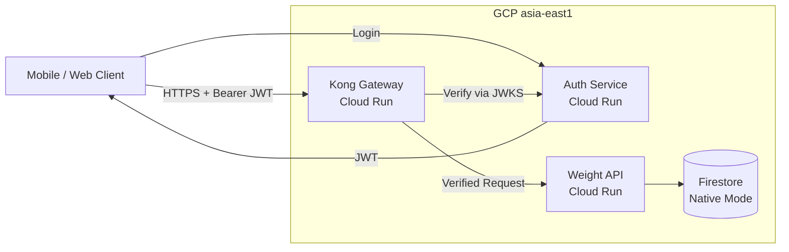

### 3.2 設計原則

本系統採用**自建最小 OIDC Auth Service** 作為初始方案，並遵循以下原則以確保未來可無痛升級至 Keycloak 或 Firebase Auth：

1. **API 驗證方式固定為 Bearer JWT** - 不混用 API Key 或其他認證方式
2. **JWT Claims 遵循 OIDC 標準** - 使用標準欄位，不自創核心欄位
3. **JWKS Endpoint 遵循慣例** - 使用 `/.well-known/jwks.json`
4. **身份分離設計** - 外部身份（IdP sub）與內部身份（internalUserId）分離
5. **授權邏輯獨立於 IdP** - 權限資料存放在自己的 Firestore，不依賴 IdP 角色

---

## 4. GCP 元件說明

### 4.1 Auth Service（自建最小 OIDC Provider）

本系統初期採用自建 Auth Service，實作 OIDC 的最小子集合，未來可平滑升級至 Keycloak 或 Firebase Auth。

#### 4.1.1 Auth Service 職責

- 使用者註冊、登入
- 簽發短效 JWT（Access Token）
- 提供 JWKS Endpoint 供 Kong Gateway 驗簽

#### 4.1.2 Auth Service Endpoints

| Endpoint | 說明 |
|----------|------|
| `POST /auth/register` | 使用者註冊 |
| `POST /auth/token` | 登入取得 JWT |
| `GET /.well-known/jwks.json` | 公鑰 JWKS Endpoint |

**POST /auth/register** - 使用者註冊

Request Body:
```json
{
  "email": "user@example.com",
  "password": "SecureP@ss123",
  "displayName": "王小明",
  "inviteCode": "BABY2026"
}
```

Response (201 Created):
```json
{
  "userId": "user_01JHXYZ...",
  "email": "user@example.com",
  "displayName": "王小明"
}
```

錯誤回應：
- 400：格式錯誤（缺少必要欄位、Email 格式不正確）
- 403：邀請碼無效或已過期
- 409：Email 已被註冊

密碼要求：
- 最少 8 字元
- 至少包含一個大寫字母、一個小寫字母、一個數字

**邀請碼機制**：
- 註冊時必須提供有效的邀請碼
- 邀請碼透過環境變數 `INVITE_CODES` 設定（逗號分隔，支援多組）
- 範例：`INVITE_CODES=BABY2026,FAMILY123`
- 若未設定邀請碼，則關閉此檢查（方便本地開發）

---

**POST /auth/token** - 登入取得 JWT

Request Body:
```json
{
  "email": "user@example.com",
  "password": "SecureP@ss123"
}
```

Response (200 OK):
```json
{
  "access_token": "eyJhbGciOiJSUzI1NiIs...",
  "token_type": "Bearer",
  "expires_in": 3600
}
```

錯誤回應：
- 400：格式錯誤
- 401：Email 或密碼錯誤

---

#### 4.1.3 JWT Token 規格

**Token 類型**：Access Token（短效，不實作 Refresh Token）

**Token 有效期**：建議 1 小時

**必要 Claims（遵循 OIDC 標準）**：

| Claim | 說明 | 範例 |
|-------|------|------|
| `iss` | Issuer URL（HTTPS，穩定不變） | `https://auth.yourdomain.com` |
| `aud` | Audience（Kong Gateway 驗證用） | `baby-weight-api` |
| `sub` | Subject（外部使用者唯一識別） | `user_01JHXYZ...`（ULID 格式） |
| `exp` | Token 過期時間 | Unix timestamp |
| `iat` | Token 簽發時間 | Unix timestamp |

**選用 Claims（建議加入）**：

| Claim | 說明 |
|-------|------|
| `email` | 使用者 Email |
| `scope` | 權限範圍，如 `weights:read weights:write` |

#### 4.1.4 JWKS 規格

```json
{
  "keys": [
    {
      "kty": "RSA",
      "kid": "key-2026-01",
      "use": "sig",
      "alg": "RS256",
      "n": "...",
      "e": "AQAB"
    }
  ]
}
```

**重點**：
- 每把 key 必須有唯一 `kid`
- 支援 key rotation（新增 key 後，舊 key 保留一段時間）

#### 4.1.5 登入方式

- Email / Password（初期）
- Google OAuth（未來可擴充）

---

### 4.2 Kong Gateway（on Cloud Run）

本系統使用 **Kong Gateway** 作為 API 閘道，部署於 Cloud Run 上。

#### 4.2.1 為什麼選擇 Kong 而非 GCP API Gateway？

| 項目 | GCP API Gateway | Kong on Cloud Run |
|------|-----------------|-------------------|
| 區域支援 | ❌ 不支援 asia-east1 | ✅ 支援所有 Cloud Run 區域 |
| 延遲 | 需繞道東京（+60-100ms） | 與服務同區域（零額外延遲） |
| 部署時間 | 10-20 分鐘 | 1-2 分鐘 |
| 功能豐富度 | 基本 | 豐富（插件生態系） |
| 成本 | 按請求計費 | Cloud Run 計費 |

#### 4.2.2 Kong 部署架構

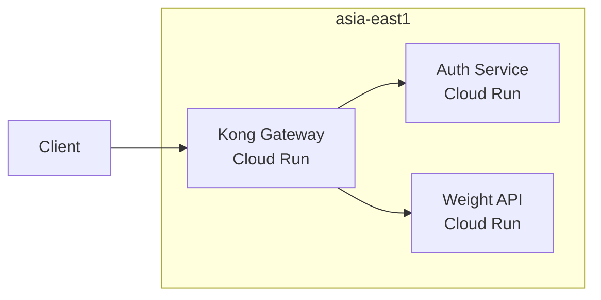

#### 4.2.3 Kong 設定（DB-less Mode）

Kong 使用宣告式配置，無需資料庫：

```yaml
# kong/kong.yml
_format_version: "3.0"
_transform: true

services:
  - name: auth-service
    url: ${AUTH_SERVICE_URL}
    routes:
      - name: auth-routes
        paths:
          - /auth
          - /.well-known
        strip_path: false

  - name: weight-api
    url: ${API_SERVICE_URL}
    routes:
      - name: api-routes
        paths:
          - /v1
        strip_path: false
    plugins:
      - name: jwt
        config:
          key_claim_name: kid
          claims_to_verify:
            - exp

plugins:
  - name: cors
    config:
      origins:
        - "*"
      methods:
        - GET
        - POST
        - PUT
        - DELETE
      headers:
        - Authorization
        - Content-Type

  - name: rate-limiting
    config:
      minute: 100
      policy: local
```

#### 4.2.4 Kong Cloud Run 設定

| 設定項 | 值 |
|--------|-----|
| Image | `kong:3.6-alpine` |
| Port | `8000` |
| CPU | `1` |
| Memory | `512Mi` |
| Min Instances | `0`（Dev）/ `1`（Prod） |
| 環境變數 | `KONG_DATABASE=off`, `KONG_DECLARATIVE_CONFIG=/kong/kong.yml` |

#### 4.2.5 Kong 負責事項

- ✅ HTTPS termination（Cloud Run 自動處理）
- ✅ JWT 驗證（AuthN）- 透過 JWKS 驗簽
- ✅ API routing
- ✅ Rate limiting
- ✅ CORS 處理
- ✅ Request/Response 日誌
- ❌ 不負責業務邏輯與資料權限判斷（AuthZ 由後端處理）

> 💡 **升級提示**：未來切換 IdP 時，只需修改 Kong JWT plugin 的 JWKS URL 即可

---

### 4.3 Cloud Run – Weight API Service

- Stateless REST API
- 主要責任：
  - 從 JWT 取得外部身份（`iss` + `sub`）
  - 透過 `identity_links` 解析為 `internalUserId`
  - 檢查使用者對嬰兒的存取權限（AuthZ）
  - 寫入 / 查詢 Firestore
- 支援自動水平擴展
- `min-instances = 0`

**身份解析流程**：

```
JWT.sub (外部身份) → identity_links → internalUserId (內部身份) → memberships (權限)
```

> 💡 **升級提示**：換 IdP 後，只需在 `identity_links` 新增一筆對應，即可綁定到同一個 `internalUserId`

---

### 4.4 Firestore（Native Mode）

- NoSQL Document Database
- 高可用、免維運
- 使用 Document 結構支援多使用者共享資料

---

## 5. 認證與授權設計

### 5.1 認證流程（AuthN）

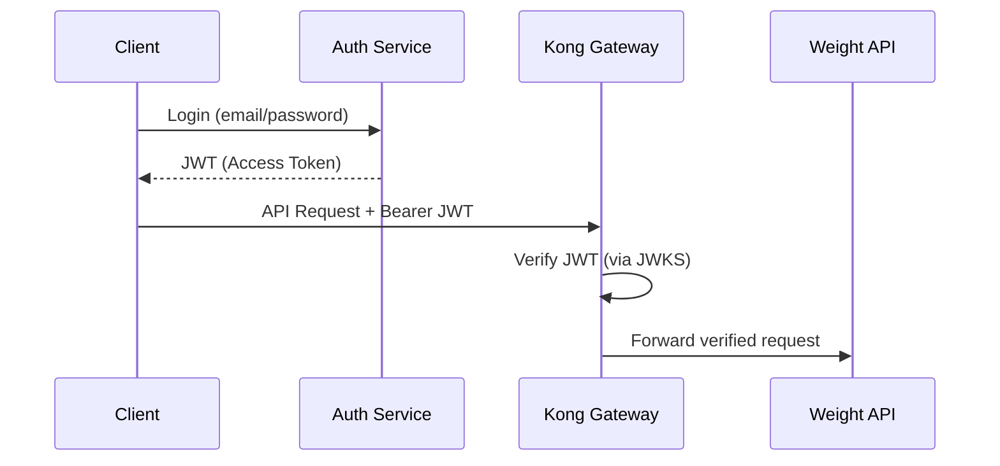

---

### 5.2 授權流程（AuthZ）

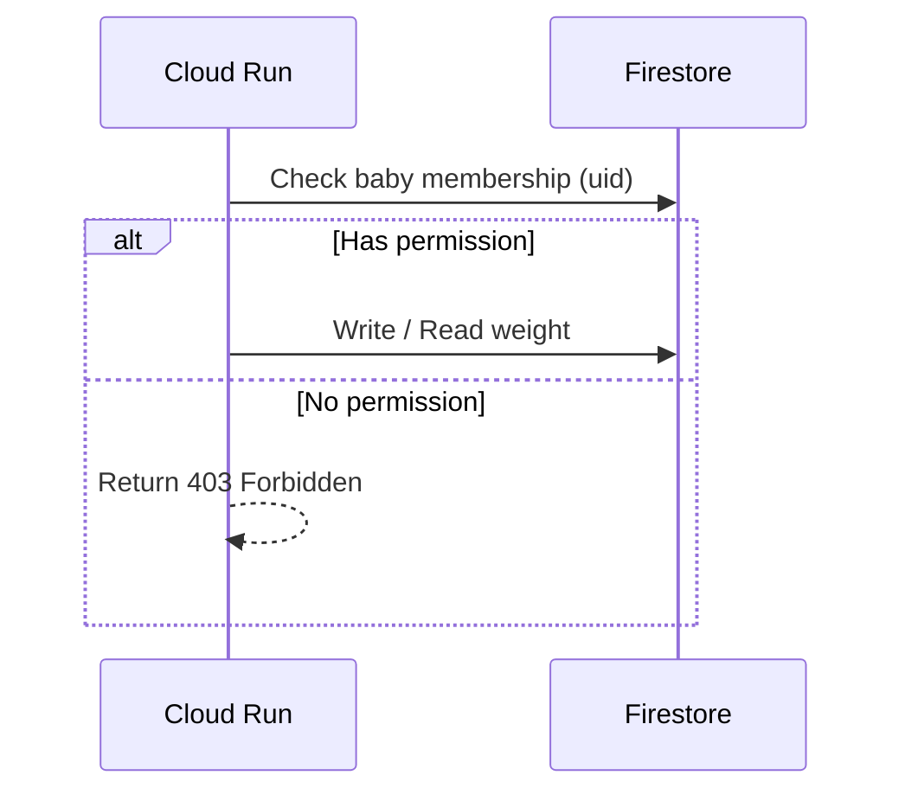

---

## 6. Firestore 資料模型設計

### 6.1 內部使用者 ID 格式

本系統使用 **ULID**（Universally Unique Lexicographically Sortable Identifier）作為 `internalUserId` 格式：

- 格式：`01JHXYZ1234567890ABCDEF`（26 字元）
- 特性：
  - 時間排序性（前 10 字元為 timestamp）
  - 全域唯一
  - URL safe
  - 比 UUID 更短且可排序

### 6.2 Collections 結構

```
# 身份對應表（IdP 可替換設計的關鍵）
identity_links/{linkId}
  - providerIss: "https://auth.yourdomain.com"  # IdP issuer
  - providerSub: "user_01JHXYZ..."              # IdP subject
  - internalUserId: "01JHXYZ..."                # 系統內部 ID (ULID)
  - createdAt

# 使用者資料（使用 internalUserId）
users/{internalUserId}
  - displayName
  - email
  - createdAt

# 嬰兒資料
babies/{babyId}
  - name
  - birthDate
  - gender: male | female    # 成長曲線評估需要
  - createdAt

# 成員權限（使用 internalUserId）
babies/{babyId}/members/{internalUserId}
  - role: owner | editor | viewer
  - joinedAt

# 體重記錄
babies/{babyId}/weights/{weightId}
  - timestamp
  - weight_g
  - note
  - createdBy: {internalUserId}
  - createdAt
```

### 6.3 identity_links 查詢索引

建立複合索引以支援快速查詢：

```
Collection: identity_links
Fields: providerIss (ASC), providerSub (ASC)
```

### 6.4 身份解析流程

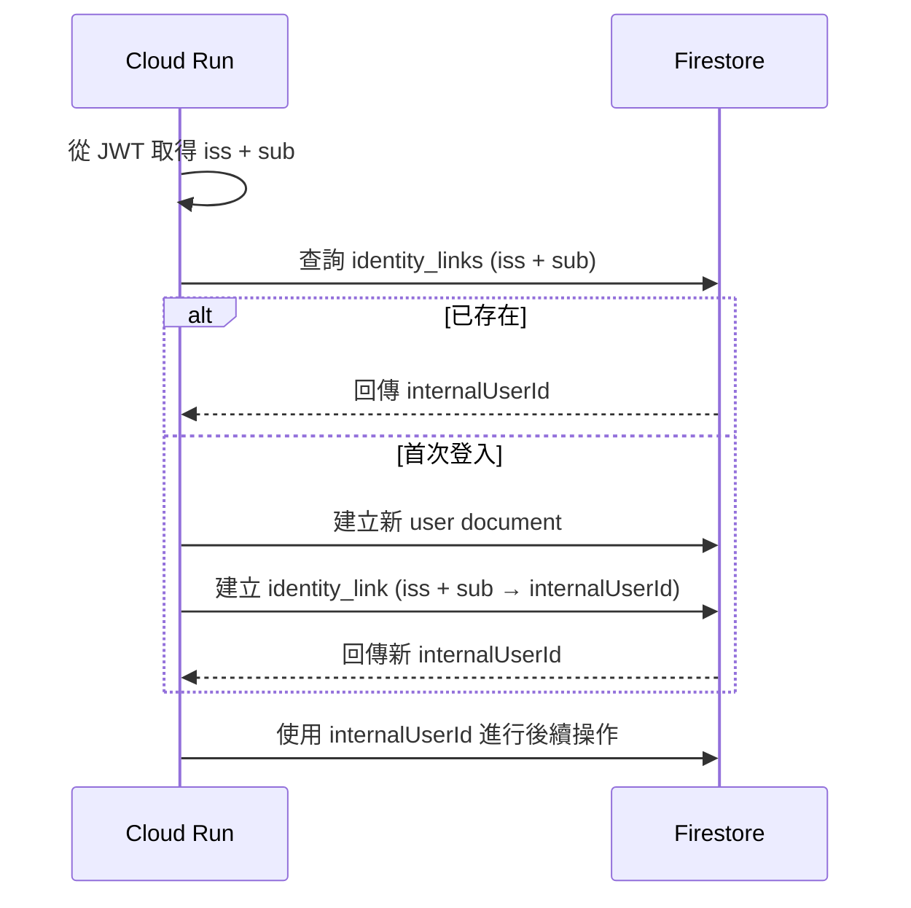

---

### 6.5 權限邏輯

| Role   | Read Weight | Write Weight | Manage Members |
|------|------------|-------------|----------------|
| owner | ✅         | ✅          | ✅             |
| editor| ✅         | ✅          | ❌             |
| viewer| ✅         | ❌          | ❌             |

---

## 7. API 規格（v1）

### 7.1 建立嬰兒

**POST** `/v1/babies`

Request Body:
```json
{
  "name": "Baby A",
  "birthDate": "2025-12-01",
  "gender": "male"
}
```

| 欄位 | 必填 | 說明 |
|------|------|------|
| `name` | ✅ | 嬰兒名稱 |
| `birthDate` | ✅ | 出生日期（ISO 8601） |
| `gender` | ✅ | 性別：`male` 或 `female`（成長曲線評估需要） |

Response:
```json
{
  "babyId": "abc123"
}
```

---

### 7.2 新增體重紀錄

**POST** `/v1/babies/{babyId}/weights`

Headers:
- Authorization: Bearer <JWT>
- Idempotency-Key: <uuid>

Request Body:
```json
{
  "timestamp": "2026-01-10T08:00:00Z",
  "weight_g": 4200,
  "note": "Morning measurement"
}
```

---

### 7.3 查詢體重紀錄

**GET** `/v1/babies/{babyId}/weights?from=2026-01-01&to=2026-01-31`

Response:
```json
[
  {
    "weightId": "w123",
    "timestamp": "2026-01-10T08:00:00Z",
    "weight_g": 4200,
    "note": "Morning measurement",
    "createdBy": "01JHXYZ...",
    "createdAt": "2026-01-10T08:05:00Z"
  }
]
```

---

### 7.4 修改體重紀錄

**PUT** `/v1/babies/{babyId}/weights/{weightId}`

Headers:
- Authorization: Bearer <JWT>

Request Body:
```json
{
  "timestamp": "2026-01-10T08:30:00Z",
  "weight_g": 4250,
  "note": "Morning measurement (corrected)"
}
```

Response:
```json
{
  "weightId": "w123",
  "timestamp": "2026-01-10T08:30:00Z",
  "weight_g": 4250,
  "note": "Morning measurement (corrected)",
  "updatedAt": "2026-01-10T09:00:00Z"
}
```

**權限**：需要 `owner` 或 `editor` 角色

---

### 7.5 刪除體重紀錄

**DELETE** `/v1/babies/{babyId}/weights/{weightId}`

Headers:
- Authorization: Bearer <JWT>

Response:
- 204 No Content（成功刪除）

**權限**：需要 `owner` 或 `editor` 角色

---

### 7.6 成長曲線評估

**GET** `/v1/babies/{babyId}/weights/{weightId}/assessment`

根據 WHO 嬰幼兒成長標準，評估該筆體重紀錄是否在正常範圍內。

Headers:
- Authorization: Bearer <JWT>

Response:
```json
{
  "weightId": "w123",
  "weight_g": 4200,
  "ageInDays": 42,
  "gender": "male",
  "percentile": 25.3,
  "zScore": -0.67,
  "assessment": "normal",
  "message": "體重在正常範圍內（第 25 百分位）",
  "referenceRange": {
    "p3": 3200,
    "p15": 3600,
    "p50": 4100,
    "p85": 4600,
    "p97": 5000
  }
}
```

**Response 欄位說明**：

| 欄位 | 說明 |
|------|------|
| `percentile` | 百分位數（0-100），表示在同齡嬰兒中的排名 |
| `zScore` | Z 分數，與平均值的標準差距離 |
| `assessment` | 評估結果：見下表 |
| `message` | 給家長的友善訊息 |
| `referenceRange` | 該年齡/性別的參考體重範圍（各百分位） |

**評估結果（assessment）**：

| 值 | 百分位範圍 | 說明 | 訊息範例 |
|----|-----------|------|----------|
| `severely_underweight` | < 3rd | 嚴重過輕 | ⚠️ 體重明顯偏低，建議諮詢醫師 |
| `underweight` | 3rd - 15th | 偏輕 | 體重稍微偏輕，可多觀察 |
| `normal` | 15th - 85th | 正常 | ✅ 體重在正常範圍內 |
| `overweight` | 85th - 97th | 偏重 | 體重稍微偏重，可多觀察 |
| `severely_overweight` | > 97th | 嚴重過重 | ⚠️ 體重明顯偏高，建議諮詢醫師 |

**成長曲線資料來源**：
- [WHO Child Growth Standards](https://www.who.int/tools/child-growth-standards)
- 適用年齡：0-5 歲
- 資料包含：男/女嬰的體重對年齡百分位表

---

### 7.7 批次成長曲線評估（查詢時附帶）

查詢體重紀錄時可選擇附帶成長評估：

**GET** `/v1/babies/{babyId}/weights?from=2026-01-01&to=2026-01-31&includeAssessment=true`

Response:
```json
[
  {
    "weightId": "w123",
    "timestamp": "2026-01-10T08:00:00Z",
    "weight_g": 4200,
    "note": "Morning measurement",
    "assessment": {
      "percentile": 25.3,
      "assessment": "normal",
      "message": "體重在正常範圍內（第 25 百分位）"
    }
  }
]
```

> 💡 **效能考量**：`includeAssessment=true` 會增加計算開銷，建議僅在需要時使用

---

## 8. 錯誤處理

| HTTP Status | 說明 |
|------------|------|
| 400 | Request 格式錯誤 |
| 401 | 未通過認證 |
| 403 | 無存取權限 |
| 404 | 資源不存在 |
| 409 | 重複請求（Idempotency） |
| 500 | 內部錯誤 |

---

## 9. 部署與維運建議

### 9.1 基礎設施即程式碼（IaC）

本專案使用 **Terraform** 管理所有 GCP 基礎建設，確保環境一致性與可重現性。

#### 9.1.1 Terraform 管理的 GCP 資源

| 資源類型 | 說明 |
|----------|------|
| `google_project` | GCP 專案（可選，若已存在則 import） |
| `google_cloud_run_v2_service` | Weight API Service |
| `google_cloud_run_v2_service` | Auth Service |
| `google_cloud_run_v2_service` | Kong Gateway |
| `google_firestore_database` | Firestore 資料庫 |
| `google_firestore_index` | Firestore 複合索引 |
| `google_secret_manager_secret` | 機敏資料（JWT signing key 等） |
| `google_service_account` | 服務帳號 |
| `google_project_iam_member` | IAM 權限綁定 |
| `google_artifact_registry_repository` | Container Registry |

#### 9.1.2 Terraform 專案結構

```
terraform/
├── environments/
│   ├── dev/
│   │   ├── main.tf
│   │   ├── variables.tf
│   │   ├── terraform.tfvars
│   │   └── backend.tf
│   ├── staging/
│   │   └── ...
│   └── prod/
│       └── ...
├── modules/
│   ├── cloud-run/
│   │   ├── main.tf
│   │   ├── variables.tf
│   │   └── outputs.tf
│   ├── api-gateway/
│   │   └── ...
│   ├── firestore/
│   │   └── ...
│   ├── auth-service/
│   │   └── ...
│   └── iam/
│       └── ...
└── shared/
    └── backend.tf.example
```

#### 9.1.3 環境分離策略

| 環境 | 用途 | GCP Project | 特性 |
|------|------|-------------|------|
| dev | 開發測試 | `baby-weight-dev` | min-instances=0, 較低規格 |
| staging | 整合測試 | `baby-weight-staging` | 模擬 prod 設定 |
| prod | 正式環境 | `baby-weight-prod` | min-instances=1, 高可用 |

#### 9.1.4 Terraform State 管理

使用 GCS Backend 儲存 Terraform state：

```hcl
# backend.tf
terraform {
  backend "gcs" {
    bucket = "baby-weight-terraform-state"
    prefix = "env/dev"
  }
}
```

**State 隔離原則**：
- 每個環境使用獨立的 state file（透過不同 prefix）
- State bucket 啟用版本控制
- 限制 state bucket 的存取權限

#### 9.1.5 機敏資料處理

Terraform 不直接管理機敏資料內容，僅建立 Secret Manager 資源：

```hcl
# 建立 secret 容器
resource "google_secret_manager_secret" "jwt_signing_key" {
  secret_id = "jwt-signing-key"
  replication {
    auto {}
  }
}

# secret 值透過 gcloud 或 CI/CD 手動設定
# gcloud secrets versions add jwt-signing-key --data-file=key.pem
```

#### 9.1.6 部署流程

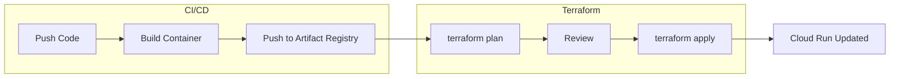

**部署步驟**：

1. **Container Build**：CI/CD 建置並推送 container image
2. **Terraform Plan**：檢視基礎建設變更
3. **Terraform Apply**：套用變更（含 Cloud Run 新版本部署）

#### 9.1.7 關鍵 Terraform 設定範例

**Cloud Run Service**：

```hcl
resource "google_cloud_run_v2_service" "weight_api" {
  name     = "weight-api"
  location = var.region
  
  template {
    containers {
      image = "${var.region}-docker.pkg.dev/${var.project_id}/baby-weight/weight-api:${var.image_tag}"
      
      env {
        name  = "AUTH_MODE"
        value = "oidc"
      }
      env {
        name  = "AUTH_ISSUER"
        value = var.auth_issuer
      }
      env {
        name = "JWT_SIGNING_KEY"
        value_source {
          secret_key_ref {
            secret  = google_secret_manager_secret.jwt_signing_key.secret_id
            version = "latest"
          }
        }
      }
    }
    
    scaling {
      min_instance_count = var.environment == "prod" ? 1 : 0
      max_instance_count = 10
    }
  }
  
  traffic {
    type    = "TRAFFIC_TARGET_ALLOCATION_TYPE_LATEST"
    percent = 100
  }
}
```

**Firestore Index**：

```hcl
resource "google_firestore_index" "identity_links_lookup" {
  project    = var.project_id
  database   = "(default)"
  collection = "identity_links"

  fields {
    field_path = "providerIss"
    order      = "ASCENDING"
  }
  fields {
    field_path = "providerSub"
    order      = "ASCENDING"
  }
}
```

### 9.2 Cloud Run 設定

- CPU only during request
- Auto scale enabled
- 環境變數透過 Terraform 管理

### 9.3 Firestore 設定

- 建立 timestamp range query index
- 建立 identity_links 複合索引

### 9.4 Logging 設定

- 設定 log retention
- 建立 log-based metrics（可選）

### 9.5 Secrets 管理

- 使用 Secret Manager 存放：
  - JWT Signing Key（RSA Private Key）
  - 其他機敏設定
- Cloud Run 透過 IAM 存取 secrets

---

### 9.6 GitHub Actions CI/CD

本專案使用 **GitHub Actions** 作為 CI/CD 平台，整合 Terraform 進行自動化部署。

#### 9.6.1 Workflow 總覽

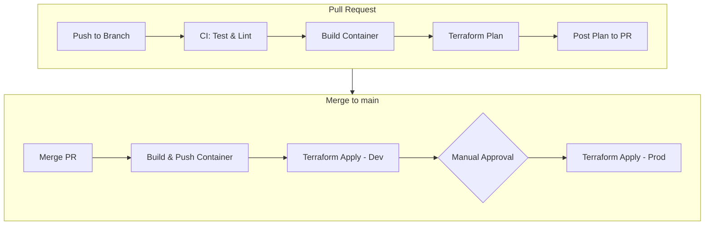

#### 9.6.2 GitHub Actions 檔案結構

```
.github/
├── workflows/
│   ├── ci.yml              # PR 時執行：test, lint, build
│   ├── deploy-dev.yml      # merge 到 main 時部署 dev
│   ├── deploy-prod.yml     # 手動觸發部署 prod
│   └── terraform-plan.yml  # PR 時執行 terraform plan
└── actions/
    └── setup-gcp/
        └── action.yml      # 共用的 GCP 認證 action
```

#### 9.6.3 GCP 認證設定（Workload Identity Federation）

使用 **Workload Identity Federation** 取代 Service Account Key，更安全：

**Terraform 設定（建立 Workload Identity Pool）**：

```hcl
# 建立 Workload Identity Pool
resource "google_iam_workload_identity_pool" "github" {
  workload_identity_pool_id = "github-actions"
  display_name              = "GitHub Actions"
}

# 建立 Provider
resource "google_iam_workload_identity_pool_provider" "github" {
  workload_identity_pool_id          = google_iam_workload_identity_pool.github.workload_identity_pool_id
  workload_identity_pool_provider_id = "github-provider"
  
  attribute_mapping = {
    "google.subject"       = "assertion.sub"
    "attribute.actor"      = "assertion.actor"
    "attribute.repository" = "assertion.repository"
  }
  
  oidc {
    issuer_uri = "https://token.actions.githubusercontent.com"
  }
}

# 綁定 Service Account
resource "google_service_account_iam_member" "github_actions" {
  service_account_id = google_service_account.deployer.name
  role               = "roles/iam.workloadIdentityUser"
  member             = "principalSet://iam.googleapis.com/${google_iam_workload_identity_pool.github.name}/attribute.repository/${var.github_repo}"
}
```

**GitHub Secrets 設定**：

| Secret 名稱 | 說明 |
|-------------|------|
| `GCP_PROJECT_ID` | GCP 專案 ID |
| `GCP_WORKLOAD_IDENTITY_PROVIDER` | Workload Identity Provider 完整路徑 |
| `GCP_SERVICE_ACCOUNT` | 部署用 Service Account Email |

#### 9.6.4 CI Workflow（ci.yml）

```yaml
name: CI

on:
  pull_request:
    branches: [main]
  push:
    branches: [main]

env:
  PYTHON_VERSION: '3.12'

jobs:
  test:
    runs-on: ubuntu-latest
    steps:
      - uses: actions/checkout@v4
      
      - name: Set up Python
        uses: actions/setup-python@v5
        with:
          python-version: ${{ env.PYTHON_VERSION }}
      
      - name: Install dependencies
        run: |
          python -m pip install --upgrade pip
          pip install -r requirements.txt
          pip install -r requirements-dev.txt
      
      - name: Run tests
        run: pytest -v --cov=. --cov-report=xml
      
      - name: Upload coverage
        uses: codecov/codecov-action@v4
        with:
          files: ./coverage.xml

  lint:
    runs-on: ubuntu-latest
    steps:
      - uses: actions/checkout@v4
      
      - name: Set up Python
        uses: actions/setup-python@v5
        with:
          python-version: ${{ env.PYTHON_VERSION }}
      
      - name: Install linters
        run: |
          pip install ruff mypy
      
      - name: Run Ruff (linter + formatter check)
        run: ruff check . && ruff format --check .
      
      - name: Run MyPy (type check)
        run: mypy .

  build:
    runs-on: ubuntu-latest
    needs: [test, lint]
    steps:
      - uses: actions/checkout@v4
      
      - name: Build container (test only)
        run: |
          docker build -t weight-api:test -f api/Dockerfile .
          docker build -t auth-service:test -f auth/Dockerfile .
```

#### 9.6.5 Deploy Dev Workflow（deploy-dev.yml）

```yaml
name: Deploy to Dev

on:
  push:
    branches: [main]

env:
  REGION: asia-east1
  ENVIRONMENT: dev

jobs:
  build-and-push:
    runs-on: ubuntu-latest
    permissions:
      contents: read
      id-token: write  # 需要此權限使用 Workload Identity
    
    outputs:
      image_tag: ${{ steps.meta.outputs.version }}
    
    steps:
      - uses: actions/checkout@v4
      
      - name: Authenticate to GCP
        uses: google-github-actions/auth@v2
        with:
          workload_identity_provider: ${{ secrets.GCP_WORKLOAD_IDENTITY_PROVIDER }}
          service_account: ${{ secrets.GCP_SERVICE_ACCOUNT }}
      
      - name: Set up Cloud SDK
        uses: google-github-actions/setup-gcloud@v2
      
      - name: Configure Docker
        run: gcloud auth configure-docker ${{ env.REGION }}-docker.pkg.dev
      
      - name: Docker meta
        id: meta
        uses: docker/metadata-action@v5
        with:
          images: ${{ env.REGION }}-docker.pkg.dev/${{ secrets.GCP_PROJECT_ID }}/baby-weight/weight-api
          tags: |
            type=sha,prefix=
            type=raw,value=latest
      
      - name: Build and push
        uses: docker/build-push-action@v5
        with:
          context: .
          file: ./api/Dockerfile
          push: true
          tags: ${{ steps.meta.outputs.tags }}

  terraform-apply:
    runs-on: ubuntu-latest
    needs: build-and-push
    permissions:
      contents: read
      id-token: write
    
    defaults:
      run:
        working-directory: terraform/environments/dev
    
    steps:
      - uses: actions/checkout@v4
      
      - name: Authenticate to GCP
        uses: google-github-actions/auth@v2
        with:
          workload_identity_provider: ${{ secrets.GCP_WORKLOAD_IDENTITY_PROVIDER }}
          service_account: ${{ secrets.GCP_SERVICE_ACCOUNT }}
      
      - name: Setup Terraform
        uses: hashicorp/setup-terraform@v3
        with:
          terraform_version: 1.7.0
      
      - name: Terraform Init
        run: terraform init
      
      - name: Terraform Apply
        run: terraform apply -auto-approve -var="image_tag=${{ needs.build-and-push.outputs.image_tag }}"
```

#### 9.6.6 Deploy Prod Workflow（deploy-prod.yml）

```yaml
name: Deploy to Production

on:
  workflow_dispatch:  # 手動觸發
    inputs:
      image_tag:
        description: 'Image tag to deploy'
        required: true
        type: string

env:
  REGION: asia-east1
  ENVIRONMENT: prod

jobs:
  terraform-plan:
    runs-on: ubuntu-latest
    permissions:
      contents: read
      id-token: write
    
    defaults:
      run:
        working-directory: terraform/environments/prod
    
    steps:
      - uses: actions/checkout@v4
      
      - name: Authenticate to GCP
        uses: google-github-actions/auth@v2
        with:
          workload_identity_provider: ${{ secrets.GCP_WORKLOAD_IDENTITY_PROVIDER_PROD }}
          service_account: ${{ secrets.GCP_SERVICE_ACCOUNT_PROD }}
      
      - name: Setup Terraform
        uses: hashicorp/setup-terraform@v3
      
      - name: Terraform Init
        run: terraform init
      
      - name: Terraform Plan
        run: terraform plan -var="image_tag=${{ inputs.image_tag }}" -out=tfplan
      
      - name: Upload plan
        uses: actions/upload-artifact@v4
        with:
          name: tfplan
          path: terraform/environments/prod/tfplan

  terraform-apply:
    runs-on: ubuntu-latest
    needs: terraform-plan
    environment: production  # 需要 approval
    permissions:
      contents: read
      id-token: write
    
    defaults:
      run:
        working-directory: terraform/environments/prod
    
    steps:
      - uses: actions/checkout@v4
      
      - name: Download plan
        uses: actions/download-artifact@v4
        with:
          name: tfplan
          path: terraform/environments/prod
      
      - name: Authenticate to GCP
        uses: google-github-actions/auth@v2
        with:
          workload_identity_provider: ${{ secrets.GCP_WORKLOAD_IDENTITY_PROVIDER_PROD }}
          service_account: ${{ secrets.GCP_SERVICE_ACCOUNT_PROD }}
      
      - name: Setup Terraform
        uses: hashicorp/setup-terraform@v3
      
      - name: Terraform Init
        run: terraform init
      
      - name: Terraform Apply
        run: terraform apply tfplan
```

#### 9.6.7 Terraform Plan for PR（terraform-plan.yml）

```yaml
name: Terraform Plan

on:
  pull_request:
    paths:
      - 'terraform/**'

jobs:
  plan:
    runs-on: ubuntu-latest
    permissions:
      contents: read
      id-token: write
      pull-requests: write  # 需要此權限發表 PR comment
    
    strategy:
      matrix:
        environment: [dev, prod]
    
    defaults:
      run:
        working-directory: terraform/environments/${{ matrix.environment }}
    
    steps:
      - uses: actions/checkout@v4
      
      - name: Authenticate to GCP
        uses: google-github-actions/auth@v2
        with:
          workload_identity_provider: ${{ secrets.GCP_WORKLOAD_IDENTITY_PROVIDER }}
          service_account: ${{ secrets.GCP_SERVICE_ACCOUNT }}
      
      - name: Setup Terraform
        uses: hashicorp/setup-terraform@v3
      
      - name: Terraform Init
        run: terraform init
      
      - name: Terraform Plan
        id: plan
        run: terraform plan -no-color
        continue-on-error: true
      
      - name: Post Plan to PR
        uses: actions/github-script@v7
        with:
          script: |
            const output = `#### Terraform Plan - ${{ matrix.environment }} 📖
            
            \`\`\`
            ${{ steps.plan.outputs.stdout }}
            \`\`\`
            
            *Pushed by: @${{ github.actor }}*`;
            
            github.rest.issues.createComment({
              issue_number: context.issue.number,
              owner: context.repo.owner,
              repo: context.repo.repo,
              body: output
            })
```

#### 9.6.8 部署環境保護

在 GitHub Repository Settings 中設定 Environment：

| Environment | Protection Rules |
|-------------|-----------------|
| `dev` | 無（自動部署） |
| `staging` | Required reviewers: 1 |
| `production` | Required reviewers: 2, Wait timer: 5 min |

#### 9.6.9 完整部署流程

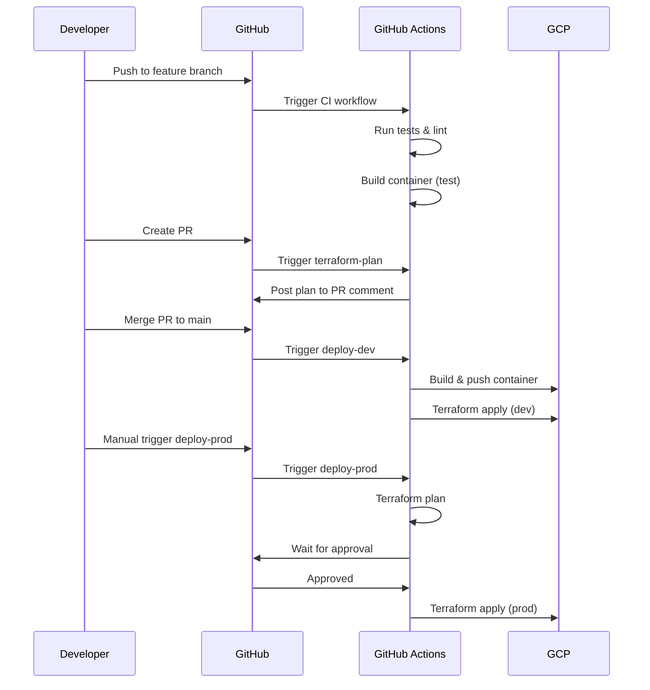

---

## 10. 本地開發與測試策略

本系統設計需支援**無雲端依賴的本地開發**，以利快速迭代與測試。

---

### 10.1 本地開發目標

- 不需連線真實 GCP
- 不需建立真實 Firestore
- 可用 curl / Postman 直接測 API
- 可模擬多使用者與權限

---

### 10.2 Firestore Emulator 開發模式（主要推薦）

#### 10.2.1 工具需求

- Node.js
- Java Runtime（Firestore Emulator 需求）
- Firebase CLI

#### 10.2.2 啟動 Emulator

```bash
npm install -g firebase-tools
firebase init emulators
firebase emulators:start --only firestore
```

Firestore Emulator 預設位置：

- Host: `localhost`
- Port: `8080`

---

#### 10.2.3 API 服務連線 Emulator

本地啟動 API 前需設定以下環境變數：

```bash
export GOOGLE_CLOUD_PROJECT=local-dev
export FIRESTORE_EMULATOR_HOST=localhost:8080
```

---

### 10.3 In-Memory Repository 模式（測試用）

為提升單元測試與 CI 穩定度，後端需實作 Repository Pattern：

- IdentityLinkRepository（身份對應）
- UserRepository
- BabyRepository
- WeightRepository
- MembershipRepository

依環境切換實作：

- Local / Test：InMemoryRepository
- Production：FirestoreRepository

---

### 10.4 本地認證（Auth）策略

#### 10.4.1 Dev Auth 模式（預設）

- 使用固定 Bearer Token：`Authorization: Bearer dev`
- Server 直接注入使用者身分：
  - providerIss = `http://localhost`
  - providerSub = `DEV_UID`
  - internalUserId = `01DEV000000000000000000000`

#### 10.4.2 本地 Auth Service（進階）

可在本地啟動自建 Auth Service，模擬完整登入流程：

```bash
# 啟動本地 Auth Service
AUTH_PORT=8082 python -m auth.main

# 啟動 API Service 指向本地 Auth
AUTH_ISSUER=http://localhost:8082 python -m api.main
```

或使用 uvicorn 直接啟動：

```bash
# Auth Service
cd auth && uvicorn main:app --port 8082 --reload

# API Service
cd api && AUTH_ISSUER=http://localhost:8082 uvicorn main:app --port 8081 --reload
```

- Client 可模擬真實登入流程
- API 端透過 JWKS 驗證 JWT

---

### 10.5 Auth 模式切換設計

| 環境 | AUTH_MODE | 認證方式 |
|----|----------|----------|
| Local Dev | dev | 固定 dev token |
| Local Adv | local-oidc | 本地 Auth Service JWT |
| Production | oidc | 自建 OIDC Auth Service JWT |
| Production (升級後) | keycloak / firebase | Keycloak / Firebase Auth JWT |

---

### 10.6 本地環境變數

#### API Service 環境變數

```bash
PORT=8081
GOOGLE_CLOUD_PROJECT=local-dev
FIRESTORE_EMULATOR_HOST=localhost:8080
AUTH_MODE=dev
DEV_UID=dev-user
DEV_INTERNAL_USER_ID=01DEV000000000000000000000

# 進階模式（使用本地 Auth Service）
# AUTH_MODE=local-oidc
# AUTH_ISSUER=http://localhost:8082
# AUTH_AUDIENCE=baby-weight-api
```

#### Auth Service 環境變數

```bash
PORT=8082
GOOGLE_CLOUD_PROJECT=local-dev
FIRESTORE_EMULATOR_HOST=localhost:8080

# JWT 簽名金鑰（RSA Private Key 路徑或內容）
JWT_PRIVATE_KEY_PATH=./keys/private.pem

# 邀請碼（逗號分隔，本地開發可不設定以關閉檢查）
# INVITE_CODES=BABY2026,FAMILY123
```

> 💡 **Production 設定**：邀請碼應透過 Secret Manager 管理，避免寫死在程式碼中

---

### 10.7 本地資料初始化建議

當 `AUTH_MODE=dev` 時，API 啟動可自動建立：

- identity_links/dev-link
  - providerIss: `http://localhost`
  - providerSub: `dev-user`
  - internalUserId: `01DEV000000000000000000000`
- users/01DEV000000000000000000000
- babies/demo-baby
- babies/demo-baby/members/01DEV000000000000000000000 (role: owner)

以利 curl / Postman 直接測試。

---

### 10.8 本地測試流程（範例）

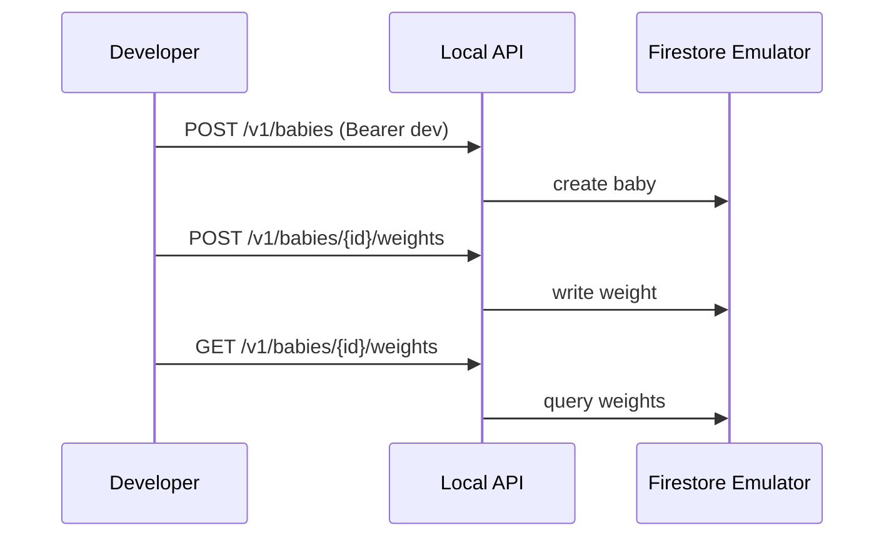

---

### 10.9 測試策略總覽

本系統設計支援多層次的測試策略，從快速本地開發到完整 E2E 測試：

#### 10.9.1 測試層次與 Auth/Gateway 配置

| 測試階段 | Auth 模式 | Kong Gateway | 用途 |
|----------|-----------|--------------|------|
| 單元測試 | Mock | 無 | 測試業務邏輯 |
| 本地開發 | `dev` | 跳過 | 快速迭代 |
| 本地整合測試 | `local-oidc` | 本地 Kong（Docker） | 測試完整 Auth + Gateway |
| Dev 環境測試 | `oidc` | Cloud Run Kong | 測試完整流程 |
| E2E / Staging | `oidc` | Cloud Run Kong | 上線前驗證 |

#### 10.9.2 繞過 Auth 的快速測試

使用 `AUTH_MODE=dev` 進行快速開發迭代：

```bash
# 直接用固定 token 測試
curl -H "Authorization: Bearer dev" \
     http://localhost:8081/v1/babies
```

Server 會自動注入假身份，無需真實認證流程。

#### 10.9.3 不繞過 Auth 的整合測試

使用 `AUTH_MODE=local-oidc` 測試完整認證流程：

```bash
# Terminal 1: 啟動本地 Auth Service
AUTH_PORT=8082 ./auth-service

# Terminal 2: 啟動 API Service（指向本地 Auth）
AUTH_MODE=local-oidc \
AUTH_ISSUER=http://localhost:8082 \
AUTH_AUDIENCE=baby-weight-api \
./api-service
```

測試流程：

```bash
# 1. 先登入取得 JWT
TOKEN=$(curl -s -X POST http://localhost:8082/auth/token \
  -H "Content-Type: application/json" \
  -d '{"email":"test@example.com","password":"testpass"}' | jq -r .access_token)

# 2. 用真實 JWT 呼叫 API
curl -H "Authorization: Bearer $TOKEN" \
     http://localhost:8081/v1/babies
```

API Service 會透過 JWKS 驗證 JWT，與 Production 行為一致。

#### 10.9.4 Kong Gateway 測試策略

**Kong 支援本地 Docker 執行**，可完整模擬生產環境行為：

| 方案 | 說明 | 優點 | 缺點 |
|------|------|------|------|
| 跳過 Gateway | 本地直接測 API | 簡單快速 | 無法測 Gateway 行為 |
| 本地 Kong（Docker） | 與生產環境相同配置 | 100% 行為一致 | 需要 Docker |
| 使用 Dev 環境 | 部署到 Cloud Run 測試 | 測試真實環境 | 迭代速度較慢 |

**建議做法**：

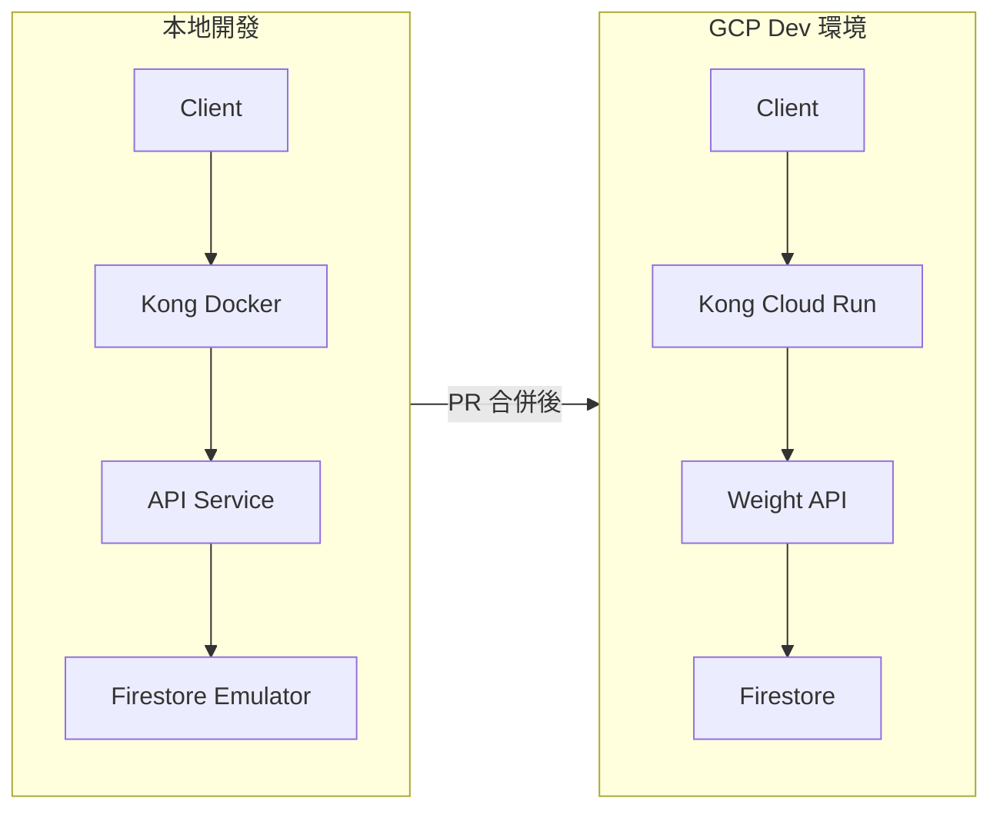

- **本地開發**：使用本地 Kong Docker，與生產環境配置完全相同
- **PR 合併後**：自動部署到 Dev 環境
- **Release**：部署到 Staging/Prod，執行 E2E 測試

#### 10.9.5 本地 Kong 整合測試（推薦）

使用 Docker Compose 啟動完整本地環境：

```yaml
# docker-compose.yml
version: '3.8'
services:
  kong:
    image: kong:3.6-alpine
    ports:
      - "8000:8000"
    environment:
      KONG_DATABASE: "off"
      KONG_DECLARATIVE_CONFIG: /kong/kong.yml
      KONG_PROXY_ACCESS_LOG: /dev/stdout
      KONG_ADMIN_ACCESS_LOG: /dev/stdout
      KONG_PROXY_ERROR_LOG: /dev/stderr
      KONG_ADMIN_ERROR_LOG: /dev/stderr
    volumes:
      - ./kong/kong.yml:/kong/kong.yml:ro
    depends_on:
      - api
      - auth
  
  auth:
    build:
      context: .
      dockerfile: auth/Dockerfile
    ports:
      - "8082:8082"
    environment:
      - PORT=8082
      - FIRESTORE_EMULATOR_HOST=firestore:8080
  
  api:
    build:
      context: .
      dockerfile: api/Dockerfile
    ports:
      - "8081:8081"
    environment:
      - PORT=8081
      - AUTH_MODE=local-oidc
      - AUTH_ISSUER=http://auth:8082
      - FIRESTORE_EMULATOR_HOST=firestore:8080
    depends_on:
      - firestore
      - auth
  
  firestore:
    image: google/cloud-sdk:emulators
    command: gcloud emulators firestore start --host-port=0.0.0.0:8080
    ports:
      - "8080:8080"
```

啟動本地環境：

```bash
docker-compose up -d

# 測試 Kong Gateway
curl http://localhost:8000/health
curl -H "Authorization: Bearer $TOKEN" http://localhost:8000/v1/babies
```

---

## 11. IdP 可替換設計

本系統採用「自建最小 OIDC Auth Service」作為初始方案，並預留未來升級至 Keycloak 或 Firebase Auth 的彈性。

### 11.1 核心相容性設計

為確保未來可無痛切換 IdP，系統遵循以下設計原則：

| 設計要點 | 說明 |
|----------|------|
| Bearer JWT 認證 | API 永遠只接受 `Authorization: Bearer <token>` |
| 標準 JWT Claims | 使用 `iss`、`aud`、`sub`、`exp`、`iat` 等 OIDC 標準欄位 |
| HTTPS Issuer | `iss` 必須是穩定的 HTTPS URL |
| 標準 JWKS 路徑 | 使用 `/.well-known/jwks.json` |
| 身份分離 | 外部身份（iss+sub）與內部身份（internalUserId）分離 |
| 授權獨立 | 權限資料存放在 Firestore，不依賴 IdP 角色 |

### 11.2 升級路線 1：自建 Auth → Keycloak

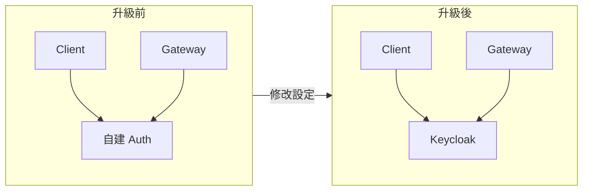

**升級步驟**：

1. **Client 端**：改為向 Keycloak 取得 token（支援 PKCE、Refresh Token）
2. **Kong Gateway**：修改 JWT plugin 的 JWKS URL 指向 Keycloak
3. **Cloud Run**：幾乎不需修改（仍透過 `identity_links` 解析身份）
4. **資料對齊**：
   - 使用者首次用 Keycloak 登入時，在 `identity_links` 新增一筆對應
   - 綁定到原有的 `internalUserId`

### 11.3 升級路線 2：自建 Auth → Firebase Auth

**升級步驟**：

1. **Client 端**：改為使用 Firebase Auth SDK 取得 ID Token
2. **Kong Gateway**：修改 JWT plugin 的 JWKS URL 指向 Firebase
3. **Cloud Run**：幾乎不需修改
4. **資料對齊**：同上

### 11.4 身份綁定策略（多 IdP 共存）

當切換 IdP 時，最大的挑戰是「新的 `sub` 與舊資料對不上」。本系統透過 `identity_links` 解決：

```
# 使用者原本用自建 Auth 登入
identity_links/link1
  - providerIss: "https://auth.yourdomain.com"
  - providerSub: "user_01JHXYZ..."
  - internalUserId: "01JHXYZ123..."

# 同一使用者改用 Keycloak 登入後，新增一筆對應
identity_links/link2
  - providerIss: "https://keycloak.yourdomain.com/realms/baby"
  - providerSub: "f47ac10b-58cc-4372-a567-0e02b2c3d479"
  - internalUserId: "01JHXYZ123..."  # 指向同一個內部 ID
```

**綁定流程**：

1. 使用者用新 IdP 登入
2. 系統檢查 `identity_links`，找不到對應
3. 提示使用者進行帳號綁定（例如用舊帳號驗證一次）
4. 建立新的 `identity_link`，指向同一個 `internalUserId`

### 11.5 升級時的元件影響

| 元件 | 升級時需修改 | 說明 |
|------|-------------|------|
| Client | ⚠️ 需修改 | 改變取得 token 的方式 |
| Kong Gateway | ⚠️ 需修改 | 更新 JWT plugin 的 JWKS URL |
| Cloud Run | ✅ 幾乎不動 | 只需確保能解析新的 iss+sub |
| Firestore 資料 | ✅ 不需搬移 | 透過 identity_links 對應即可 |

---

## 12. 開發指引

### 12.1 Python 開發規範

本專案使用 **Python 3.12+** 開發，遵循以下規範：

#### 12.1.1 Type Hints（必要）

所有程式碼必須包含完整的 type hints：

```python
from datetime import datetime
from typing import Optional
from pydantic import BaseModel

class WeightRecord(BaseModel):
    weight_id: str
    timestamp: datetime
    weight_g: int
    note: Optional[str] = None
    created_by: str
    created_at: datetime

async def get_weight(
    baby_id: str,
    weight_id: str,
) -> WeightRecord:
    """取得單筆體重紀錄"""
    ...

async def list_weights(
    baby_id: str,
    from_date: Optional[datetime] = None,
    to_date: Optional[datetime] = None,
    include_assessment: bool = False,
) -> list[WeightRecord]:
    """查詢體重紀錄列表"""
    ...
```

**Type Hints 規範**：
- 所有函數參數必須標註型別
- 所有函數必須標註回傳型別
- 使用 `Optional[T]` 表示可為 `None` 的參數
- 使用 Python 3.10+ 的原生語法（`list[T]` 而非 `List[T]`）
- 複雜型別使用 `TypeAlias` 或 `TypedDict`

#### 12.1.2 Pydantic Models

API Request/Response 使用 Pydantic v2 定義：

```python
from pydantic import BaseModel, Field, EmailStr

class RegisterRequest(BaseModel):
    email: EmailStr
    password: str = Field(min_length=8)
    display_name: str = Field(min_length=1, max_length=50)
    invite_code: str

class RegisterResponse(BaseModel):
    user_id: str
    email: str
    display_name: str
```

#### 12.1.3 MyPy 設定

專案根目錄的 `pyproject.toml` 需包含嚴格的 MyPy 設定：

```toml
[tool.mypy]
python_version = "3.12"
strict = true
warn_return_any = true
warn_unused_ignores = true
disallow_untyped_defs = true
disallow_incomplete_defs = true
check_untyped_defs = true
```

---

### 12.2 套件管理（uv）

本專案使用 **uv** 作為 Python 套件管理工具，取代傳統的 pip + venv。

#### 12.2.1 安裝 uv

```bash
# macOS / Linux
curl -LsSf https://astral.sh/uv/install.sh | sh

# 或使用 Homebrew
brew install uv
```

#### 12.2.2 專案初始化

```bash
# 建立新專案
uv init

# 設定 Python 版本
uv python pin 3.12
```

#### 12.2.3 依賴管理

```bash
# 新增依賴
uv add fastapi
uv add "uvicorn[standard]"
uv add pydantic
uv add google-cloud-firestore

# 新增開發依賴
uv add --dev pytest pytest-cov pytest-asyncio
uv add --dev ruff mypy
uv add --dev httpx  # 測試用 async client

# 同步依賴（安裝所有套件）
uv sync
```

#### 12.2.4 執行指令

```bash
# 執行 Python 腳本
uv run python -m api.main

# 執行 uvicorn
uv run uvicorn api.main:app --reload --port 8081

# 執行測試
uv run pytest

# 執行 linter
uv run ruff check .
uv run ruff format .

# 執行 type check
uv run mypy .
```

#### 12.2.5 使用 uvx 執行一次性工具

```bash
# 執行一次性工具（不需安裝到專案）
uvx ruff check .
uvx mypy .
uvx pytest
```

#### 12.2.6 pyproject.toml 範例

```toml
[project]
name = "baby-weight-api"
version = "0.1.0"
description = "嬰兒體重紀錄系統 API"
readme = "README.md"
requires-python = ">=3.12"
dependencies = [
    "fastapi>=0.109.0",
    "uvicorn[standard]>=0.27.0",
    "pydantic>=2.5.0",
    "google-cloud-firestore>=2.14.0",
    "python-jose[cryptography]>=3.3.0",
    "passlib[bcrypt]>=1.7.4",
    "python-ulid>=2.2.0",
]

[project.optional-dependencies]
dev = [
    "pytest>=8.0.0",
    "pytest-cov>=4.1.0",
    "pytest-asyncio>=0.23.0",
    "httpx>=0.26.0",
    "ruff>=0.2.0",
    "mypy>=1.8.0",
]

[tool.ruff]
target-version = "py312"
line-length = 88

[tool.ruff.lint]
select = ["E", "F", "I", "N", "W", "UP", "B", "C4", "SIM"]

[tool.mypy]
python_version = "3.12"
strict = true

[tool.pytest.ini_options]
asyncio_mode = "auto"
testpaths = ["tests"]
```

#### 12.2.7 專案結構

```
baby-weight/
├── pyproject.toml
├── uv.lock              # uv 產生的 lock file
├── .python-version      # Python 版本
├── api/
│   ├── __init__.py
│   ├── main.py
│   ├── routers/
│   │   ├── __init__.py
│   │   ├── babies.py
│   │   └── weights.py
│   ├── models/
│   │   ├── __init__.py
│   │   ├── baby.py
│   │   └── weight.py
│   ├── services/
│   │   ├── __init__.py
│   │   └── growth_assessment.py
│   └── repositories/
│       ├── __init__.py
│       ├── base.py
│       └── firestore.py
├── auth/
│   ├── __init__.py
│   ├── main.py
│   └── ...
├── tests/
│   ├── __init__.py
│   ├── test_babies.py
│   └── test_weights.py
└── terraform/
    └── ...
```

---

## 13. 未來擴充方向

- 推播提醒（Cloud Scheduler + Pub/Sub）
- 匯出 CSV / PDF
- 多裝置同步
- 升級至 Keycloak 或 Firebase Auth（支援 Refresh Token、PKCE）

---

## 14. 附錄

- 後端語言：Python 3.12+
- 套件管理：uv
- Web Framework：FastAPI
- API 採用 REST + JSON
- 時間格式：ISO 8601 (UTC)
- 重量單位：gram（避免浮點誤差）
- 內部 ID 格式：ULID（26 字元，時間可排序）
- 基礎建設管理：Terraform（>= 1.5）
- Terraform Provider：hashicorp/google（>= 5.0）
- CI/CD：GitHub Actions
- GCP 認證：Workload Identity Federation（無 Service Account Key）
- Linter/Formatter：Ruff
- Type Checker：MyPy（strict mode）
- Test Framework：pytest + pytest-asyncio

---

**End of Document**

