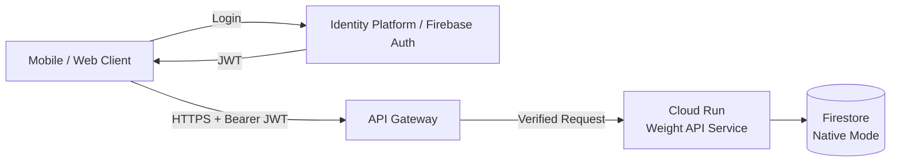
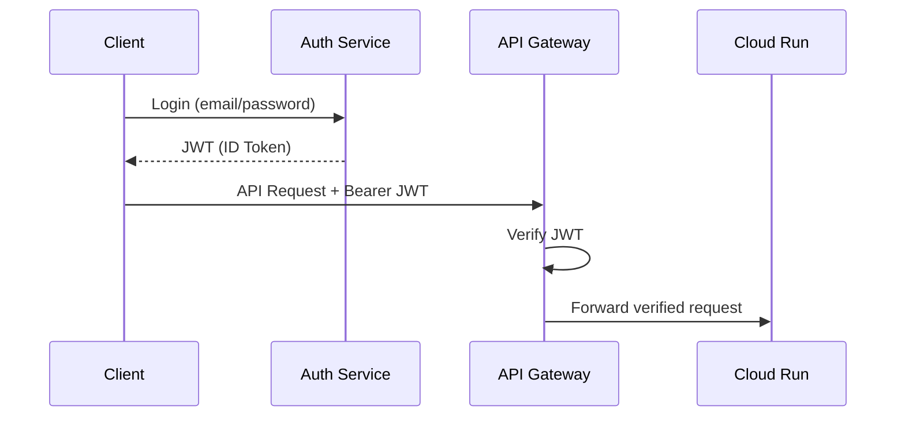
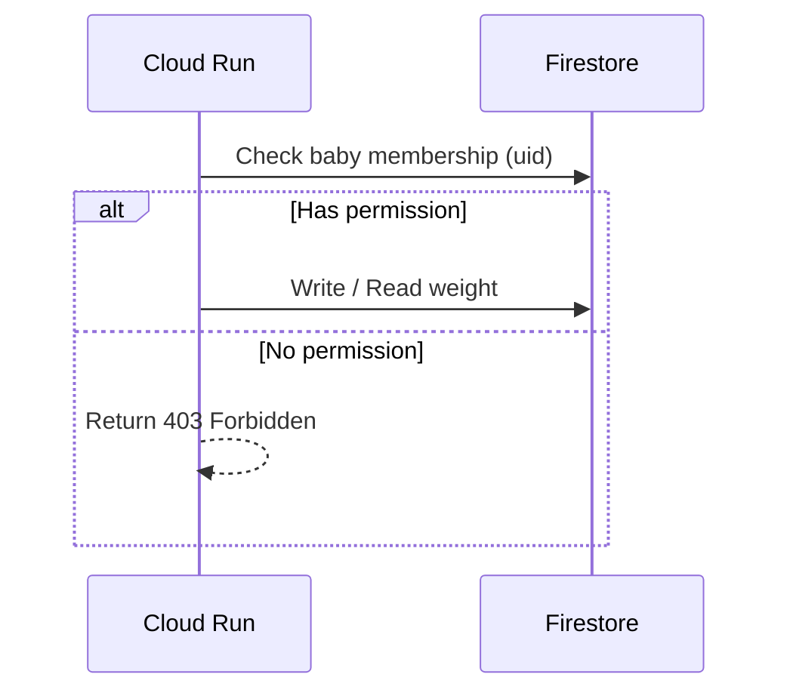
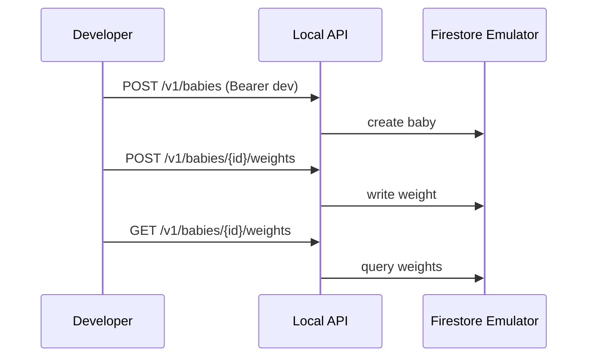

# 嬰兒體重紀錄系統

> 技術規格書（GCP / Cloud Run / API Gateway / Firestore）

---

## 1. 文件資訊

- 文件版本：v1.0
- 最後更新：2026-01-11
- 目標讀者：
  - Backend 工程師
  - Mobile / Web App 工程師
  - DevOps / Cloud 管理者

---

## 2. 系統目標與需求

### 2.1 系統目標

建立一個可在 **GCP Cloud Run** 上運行的後端系統，用於：

- 接收 Client Request 並記錄嬰兒體重
- 支援多使用者、多嬰兒
- 具備安全的 Client 認證與存取控管
- 使用低維運成本的雲端服務

### 2.2 功能性需求

- 使用者註冊 / 登入
- 建立嬰兒資料
- 記錄嬰兒體重（時間、重量、備註）
- 查詢體重歷史紀錄
- 支援多位照顧者共同管理同一嬰兒

### 2.3 非功能性需求

- HTTPS only
- Stateless backend
- 可水平擴充
- 成本可控（適合個人 / 小家庭使用）
- API versioning（v1）

---

## 3. 整體系統架構

### 3.1 架構概覽



---

## 4. GCP 元件說明

### 4.1 Identity Platform / Firebase Authentication

- 負責：
  - 使用者註冊、登入
  - 簽發 JWT (ID Token)
- 支援登入方式：
  - Email / Password
  - Google OAuth（可選）

JWT 內容重點欄位：
- `sub` / `user_id`：使用者唯一識別
- `iss`：token issuer
- `aud`：API audience

---

### 4.2 API Gateway

- 系統對外唯一入口
- 負責事項：
  - HTTPS termination
  - JWT 驗證（AuthN）
  - API routing
  - API versioning
  - 基本 rate limit / quota（可選）

**不負責業務邏輯與資料權限判斷**

---

### 4.3 Cloud Run – Weight API Service

- Stateless REST API
- 主要責任：
  - 驗證 JWT 中的使用者身分
  - 檢查使用者對嬰兒的存取權限（AuthZ）
  - 寫入 / 查詢 Firestore
- 支援自動水平擴展
- `min-instances = 0`

---

### 4.4 Firestore（Native Mode）

- NoSQL Document Database
- 高可用、免維運
- 使用 Document 結構支援多使用者共享資料

---

## 5. 認證與授權設計

### 5.1 認證流程（AuthN）



---

### 5.2 授權流程（AuthZ）



---

## 6. Firestore 資料模型設計

### 6.1 Collections 結構

```
users/{uid}
  - displayName
  - email
  - createdAt

babies/{babyId}
  - name
  - birthDate
  - createdAt

babies/{babyId}/members/{uid}
  - role: owner | editor | viewer
  - joinedAt

babies/{babyId}/weights/{weightId}
  - timestamp
  - weight_g
  - note
  - createdBy
  - createdAt
```

---

### 6.2 權限邏輯

| Role   | Read Weight | Write Weight | Manage Members |
|------|------------|-------------|----------------|
| owner | ✅         | ✅          | ✅             |
| editor| ✅         | ✅          | ❌             |
| viewer| ✅         | ❌          | ❌             |

---

## 7. API 規格（v1）

### 7.1 建立嬰兒

**POST** `/v1/babies`

Request Body:
```json
{
  "name": "Baby A",
  "birthDate": "2025-12-01"
}
```

Response:
```json
{
  "babyId": "abc123"
}
```

---

### 7.2 新增體重紀錄

**POST** `/v1/babies/{babyId}/weights`

Headers:
- Authorization: Bearer <JWT>
- Idempotency-Key: <uuid>

Request Body:
```json
{
  "timestamp": "2026-01-10T08:00:00Z",
  "weight_g": 4200,
  "note": "Morning measurement"
}
```

---

### 7.3 查詢體重紀錄

**GET** `/v1/babies/{babyId}/weights?from=2026-01-01&to=2026-01-31`

Response:
```json
[
  {
    "timestamp": "2026-01-10T08:00:00Z",
    "weight_g": 4200,
    "note": "Morning measurement"
  }
]
```

---

## 8. 錯誤處理

| HTTP Status | 說明 |
|------------|------|
| 400 | Request 格式錯誤 |
| 401 | 未通過認證 |
| 403 | 無存取權限 |
| 404 | 資源不存在 |
| 409 | 重複請求（Idempotency） |
| 500 | 內部錯誤 |

---

## 9. 部署與維運建議

- Cloud Run
  - CPU only during request
  - Auto scale enabled
- Firestore
  - 建立 timestamp range query index
- Logging
  - 設定 log retention
- Secrets
  - 使用 Secret Manager

---

## 10. 本地開發與測試策略

本系統設計需支援**無雲端依賴的本地開發**，以利快速迭代與測試。

---

### 10.1 本地開發目標

- 不需連線真實 GCP
- 不需建立真實 Firestore
- 可用 curl / Postman 直接測 API
- 可模擬多使用者與權限

---

### 10.2 Firestore Emulator 開發模式（主要推薦）

#### 10.2.1 工具需求

- Node.js
- Java Runtime（Firestore Emulator 需求）
- Firebase CLI

#### 10.2.2 啟動 Emulator

```bash
npm install -g firebase-tools
firebase init emulators
firebase emulators:start --only firestore
```

Firestore Emulator 預設位置：

- Host: `localhost`
- Port: `8080`

---

#### 10.2.3 API 服務連線 Emulator

本地啟動 API 前需設定以下環境變數：

```bash
export GOOGLE_CLOUD_PROJECT=local-dev
export FIRESTORE_EMULATOR_HOST=localhost:8080
```

---

### 10.3 In-Memory Repository 模式（測試用）

為提升單元測試與 CI 穩定度，後端需實作 Repository Pattern：

- BabyRepository
- WeightRepository
- MembershipRepository

依環境切換實作：

- Local / Test：InMemoryRepository
- Production：FirestoreRepository

---

### 10.4 本地認證（Auth）策略

#### 10.4.1 Dev Auth 模式（預設）

- 使用固定 Bearer Token：`Authorization: Bearer dev`
- Server 直接注入使用者身分：
  - uid = `DEV_UID`

#### 10.4.2 Firebase Auth Emulator（進階）

```bash
firebase emulators:start --only auth,firestore
```

- Client 可模擬真實登入流程
- API 端可切換為 Firebase Token 驗證模式

---

### 10.5 Auth 模式切換設計

| 環境 | AUTH_MODE | 認證方式 |
|----|----------|----------|
| Local Dev | dev | 固定 dev token |
| Local Adv | firebase | Auth Emulator JWT |
| Production | firebase | Identity Platform JWT |

---

### 10.6 本地 API 啟動標準環境變數

```bash
PORT=8081
GOOGLE_CLOUD_PROJECT=local-dev
FIRESTORE_EMULATOR_HOST=localhost:8080
AUTH_MODE=dev
DEV_UID=dev-user
```

---

### 10.7 本地資料初始化建議

當 `AUTH_MODE=dev` 時，API 啟動可自動建立：

- users/dev-user
- babies/demo-baby
- membership：dev-user = owner

以利 curl / Postman 直接測試。

---

### 10.8 本地測試流程（範例）



---

## 11. 未來擴充方向

- 體重成長曲線計算
- 推播提醒（Cloud Scheduler + Pub/Sub）
- 匯出 CSV / PDF
- 多裝置同步

---

## 11. 附錄

- API 採用 REST + JSON
- 時間格式：ISO 8601 (UTC)
- 重量單位：gram（避免浮點誤差）

---

**End of Document**

